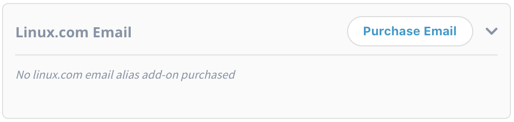
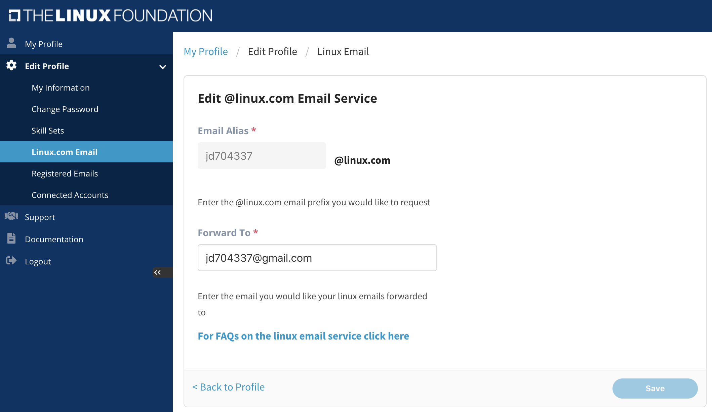

# Purchase a Lifetime Linux.com Email Alias

You can purchase a lifetime Linux.com email alias if you are an active Individual Supporter. For more information on Individual Supporter, please see [Individual Supporter](https://www.linuxfoundation.org/about/individual-supporters/) and [Individual Supporter FAQs](https://www.linuxfoundation.org/about/individual-supporters/#toggle-id-1) web pages.

1\. To purchase the Linux.com email alias, login to [myprofile.lfx.linuxfoundation.org](https://myprofile.lfx.linuxfoundation.org) and click on the **Purchase Email** CTA button on the **Linux.com Email **section.

2\. If you are enrolled in the Individual Supporter program, you will be navigated to the Lifetime Linux.com Email Alias Add-On form, **Contact Details** page. If you're not an individual supporter, you need to enroll in program before you can purchase Linux.com email alias.

3\. Once you have complete the transaction, go back to your account on My Profile Dashboard and click on the settings icon.png>)to request the linux.com alias and add the forwarding email address.&#x20;

.png>)


You can request any Linux.com email address, but issuance is subject to availability.

Emails sent to the Linux.com email alias will be sent to the forwarding email address you specify. They will not be sent to the linux.com email alias.&#x20;

NOTE: Edit Linux.com subpage will be accessible in the sidebar navigation after  you purchase the linux.com alias email.


On the **Edit @linux.com Email Service** subpage, enter the Linux.com email that you would like to request in the **Email Alias **field. In the **Forward To** field enter the email where you would to receive the emails that will be sent to your Linux.com email. Click on **Save** CTA after entering all the details and **Back to Profile** CTA to return to the dashboard.

