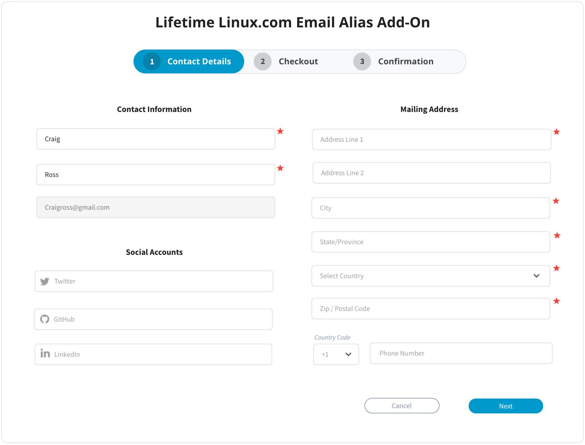
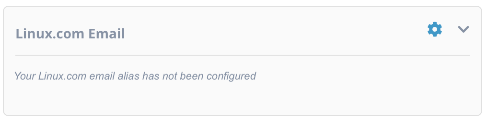
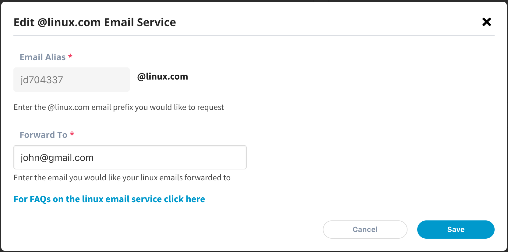

# Purchase a Lifetime Linux.com Email Alias

You can purchase Lifetime Linux.com email alias if you are an active Individual Supporter. For more information on Individual Supporter, please see [Individual Supporter](https://www.linuxfoundation.org/about/individual-supporters/) and [Individual Supporter FAQs](https://www.linuxfoundation.org/about/individual-supporters/faq/#faq1) web pages.

1. To purchase the Linux foundation email alias, navigate and login to [myprofile.linuxfoundation.org](https://myprofile.linuxfoundation.org/) and click the Purchase Email CTA button from the **Linux.com Email**.

2. If you are enrolled in the Individual Supporter program, you will be navigated to the Lifetime Linux.com Email Alias Add-On form, **Contact Details** page.

3. Once you have complete the transaction, go back to your account on My Profile app to request the linux.com alias and add the forwarding email address. Click on the settings icon  to manage your linux.com alias and the forwarding email address. 

The **Edit @linux.com Email Service** modal appears. In the **Email Alias** field, enter the Linux.com email that you would like to request. In the **Forward To** field enter the email ID where you want to receive the emails that will be sent to your Linux.com email. Click **Save** after entering all the details. You can request any Linux.com email address, but issuance is subject to availability.


Emails sent to Linux email ID will be forwarded to the Forward email ID. The mails will not be delivered to the Linux email ID.


