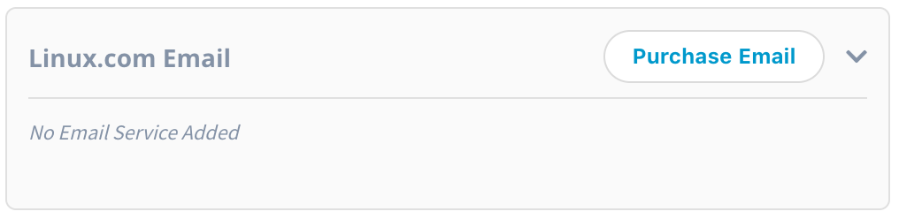

# Purchasing your Linux.com email address

You can purchase a Linux.com email if you are an Individual Supporter. For more information on Individual Supporter, please see [Individual Supporter](https://www.linuxfoundation.org/about/individual-supporters/).

You can purchase the Individual Supporter by clicking the [Purchase Individual Supporter](https://joinnow.dev.platform.linuxfoundation.org/?project=tlf&product=01t17000007X61GAAS#/enrollment). Once you purchase the Individual Supporter, you can purchase the Linux foundation email.

You can also checkout the [Individual Supporter FAQs](https://www.linuxfoundation.org/about/individual-supporters/faq/#faq1).

To purchase the Linux foundation email, perform the following steps:

1.Login to [My Profile](https://myprofile.linuxfoundation.org/) page and click the Purchase Email button from the **Linux.Com Email**.

2.The Edit @linux.com Email Service screen appears. In the **Email Alias**, enter the Linux email that you want and in the **Forward to** enter the email ID where you want to receive the emails that will be sent to Linux email ID. Click **Save** after entering all the details.


Emails sent to Linux email ID will be forwarded to the Forward email ID. The mails will not be delivered to the Linux email ID.


