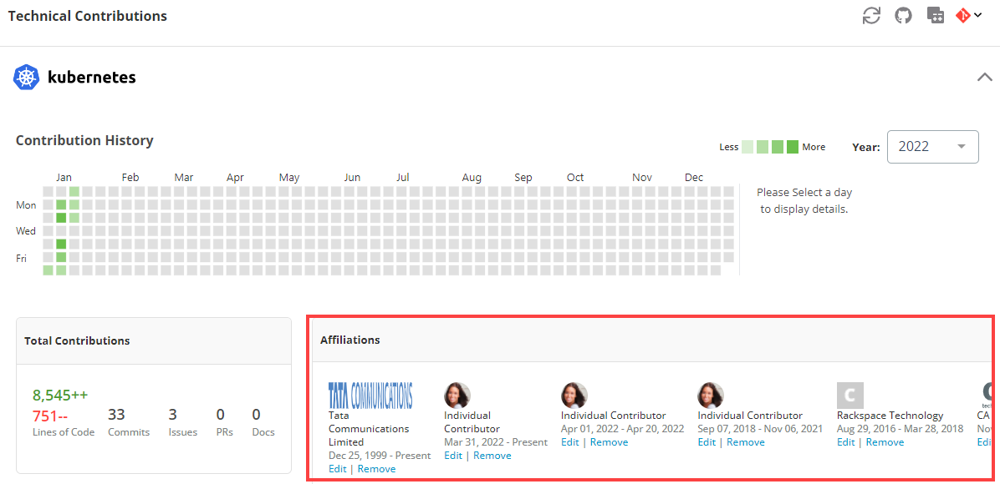

# Update Affiliations

Your project affiliations show your technical code contributions to a project by identifying your work history while you were actively contributing code or documentation. Populating your affiliations is a great way to tell your open source contribution story to your current and future employers, and your project communities. It also ensures that your organization gets credit for open source project work that you do on their behalf, or that you can highlight your individual contributions to a project. The following information is displayed:

* The name(s) of the project(s) that you have contributed to or are actively contributing to.
* The time period during which you were an active contributor.
* If you were contributing on behalf of an organization or as an individual contributor.

You should connect your GitHub and LinkedIn profiles to populate your affiliations, and ensure that your historical and future contributions all get correctly attributed to you.

### **What can you do?**

You can manage all of your project affiliations through the Individual Dashboard.

* [Add or Edit Affiliations](update-affiliations.md#add-affiliations-or-work-history)
* [Delete Affiliations](update-affiliations.md#delete-affiliation)
* [Switch Contributions to/from Individual contribution to Affiliation](update-affiliations.md#switch-contributions-to-from-individual-contribution-to-affiliation)
* [Connect or Disconnect LinkedIn](update-affiliations.md#connect-or-disconnect-linkedin)
* [Connect or Disconnect GitHub](update-affiliations.md#connect-or-disconnect-github)

### Add affiliations or work history:

1\. Log in to [https://openprofile.dev/](https://openprofile.dev).

2\. From left side navigation pane click the arrow  to expand, and navigate to **Profile > Affiliations**.

3\. Under a project name, click **+ Affiliation**.

4\. Provide details such as organization name, start date and end date, and click the _tick_ mark next to the filed to save details.


**Note:** If the organization name is not available in the predictive search list, click **+Add** CTA to [add the organization](update-affiliations.md#add-organization).


5\. To add work history, click to link your LinkedIn account to populate your employment history with the open source community.

### Delete affiliation:

Click next to an affiliation to delete the affiliation.

### Switch Contributions to/from Individual contribution to Affiliation

You can switch contributions to/from individual contributions to affiliated with an organization.

1\. Log in to [https://openprofile.dev/](https://openprofile.dev).

2\. From left side navigation pane click the arrow  to expand, and navigate to **Profile > Affiliations**.

3\. To switch from company affiliation to independent contributor, click the checkbox before **Independent Contributor**, and click the _tick_ mark next to the filed to save details.

4\. To switch from independent contributor to company affiliation, uncheck the checkbox before **Independent Contributor**, provide organization name in the **Enter Organization Name** field, select the organization from the predictive search results, and click the _tick_ mark next to the filed to save details.

**Note:** If the organization name is not available in the predictive search list, click **+Add** CTA to [add the organization](update-affiliations.md#add-organization).

### Add Organization

1\. Click **+Add** if the organization name is not shown in the predictive search list.

2\. On the Add Organization window, provide organization URL, organization name in the respective fields, and click **Add**.

### Connect or Disconnect LinkedIn:

1. To connect LinkedIn, click .png>), and log in to LinkedIn window. By connecting your LinkedIn account, you are populating your employment history with the open source community.
2. To disconnect LinkedIn, click **Disconnect LinkedIn**.

### Connect or Disconnect GitHub

1. To connect GitHub, click , log in, and authorize your GitHub account.
2. To disconnect GitHub, scroll down to the page, from bottom right corner, click **Disconnect GitHub**.
