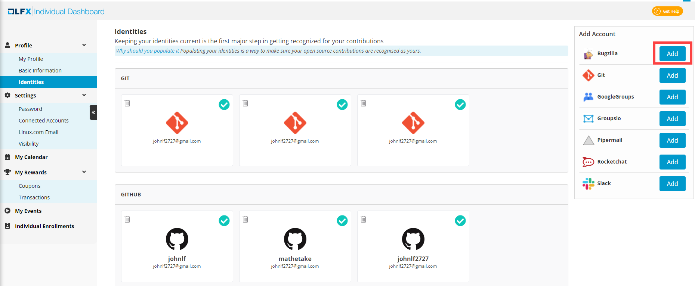

# Update Identities

Populating Identities is a great way to ensure that your open source contributions, for LF hosted projects, are recognized as yours. You are identified based on the unique username and email address your login account has.

Keeping your identities current is the first step in getting recognized for all of your LF hosted open source project contributions, and it is also a great way to get visibility into your identity security across all of the platforms that you use. You can review and verify all accounts that are currently associated with your individual profile, and can add new identities using an email address or username.

Identities window shows your project identities connected with Linux Foundation account. A green tick mark for an account shows a connected account based on your unique identity.

#### Add Identity:

1\. Log into [https://openprofile.dev](https://openprofile.dev).

2\. From left side navigation pane click the arrow  to expand, and navigate to **Profile > Identities**.

3\. Click **Connect GitHub** to connect your GitHub account.

4\. From the card, select a data source, provide your email address that you have configured with the data source, and click **Verify**.

5\. Navigate to the email address. open the verification email, and click **Verify Email**.

6\. Refresh the My Profile page to see the connected account.

#### Delete Identity:

To delete an identity, click the delete icon on a card.

