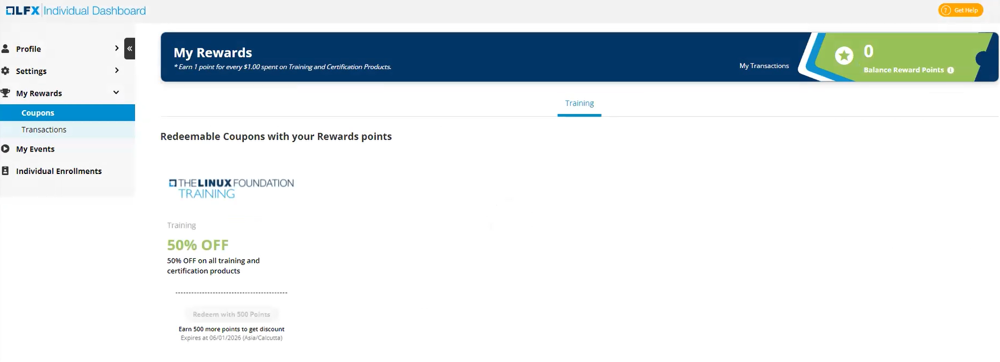
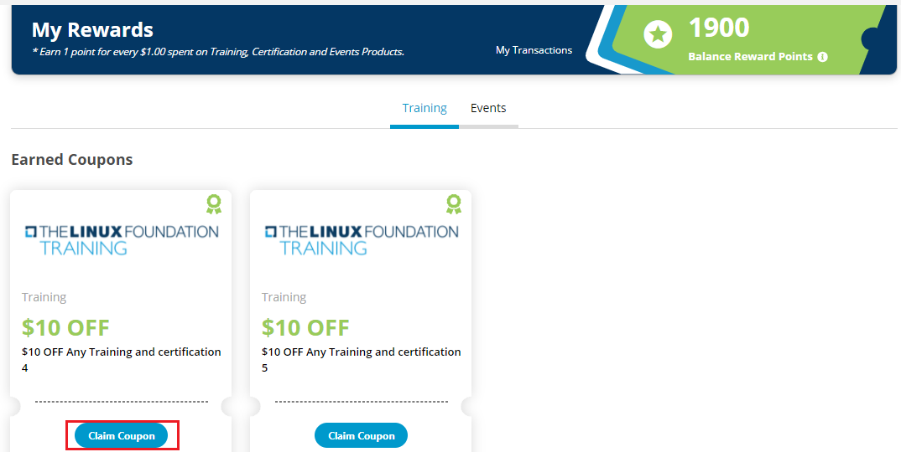

# View Rewards

My Rewards section under My Profile allows you to:

* Check the earned coupons which you have gained when you had purchased any events, trainings, and certifications from the Linux Foundation.
* Earn reward points when you purchase any training and certification products. For every $1.00 spent on training and certification products, you earn 1 point. You need minimum 500 reward points to redeem a discount coupon.
* View the transactions related to the purchases you have made through Linux Foundation.&#x20;

My Rewards consists of the following sections in it:&#x20;

* [Coupons](view-rewards.md#coupons)
* [Transactions](view-rewards.md#transactions)

## Coupons

Coupons section provides you with a list of trainings, certifications or events that you are eligible to [claim coupons](view-rewards.md#claim-the-earned-coupon) using the coupon codes. You can use these coupon code by redeeming the reward points. This section provides you the details of the trainings, certifications, events, discounts, and the reward points that you can redeem.

### Earned Coupons

Earned coupons will allow you to claim a discount for the training and certifications, and events. You are eligible for earned coupons:

* If you have registered for any event or purchased any trainings or certifications from the Linux Foundation in the past. For example, if you have registered for an event say Cloud Native conference, you will receive a earned coupon for that..
* If you have purchased any training and certification products. You earn 1 point for every $1.00 spent on training and certification products. You can redeem a coupon by using these reward points. You need minimum 500 reward points to redeem a coupon.

### Claim the earned coupon:

1\. Log into [My Profile](https://openprofile.dev) using your LF account, and from left side navigation pane, navigate to **My Rewards > Coupons**.

2\. Earned Coupons section appears with the list of trainings and certifications that you are eligible to claim the coupon code. Click **Claim Coupon**.

3\. A Pop message appears. Click **Claim Code**.

4\. Copy the discount code and paste this code at checkout on the [Training Portal](https://trainingportal.linuxfoundation.org).

5\. The same coupon code can be viewed by clicking **View Coupon Code**.

## Transactions

To view your transactions for all the purchases you made through Linux Foundation:

1. Log into [My Profile](https://openprofile.dev) using your LF account, and from left side navigation pane, navigate to **My Rewards > Transactions**.
2. In this section you can view the following transaction details:&#x20;
   1. All Transactions&#x20;
   2. Event Tickets Training + Certifications
   3. Individual Support and Linux.com Purchase

In this section you can view the following transaction details:&#x20;

* Name, which is the name of the product, event, training or certification course&#x20;
* Order ID number, which is also displayed on the order confirmation email&#x20;
* Transaction Date&#x20;
* Transaction Status, i.e. Completed&#x20;
* Transaction Value, that provides the the purchase amount

#### All Transactions&#x20;

All Transactions provides the transaction details related to all the transactions.

.png>)

#### Event Tickets

Event Tickets provides the transaction details related to the event.

#### Training and Certifications

Training and Certifications provides the transaction details related to training and certifications. Training and Certifications.

#### Individual Supporter Program and Linux.com Purchase

Individual Supporter Program and Linux.com Purchase provides transaction details related to the individual support program and Linux.com purchases.
