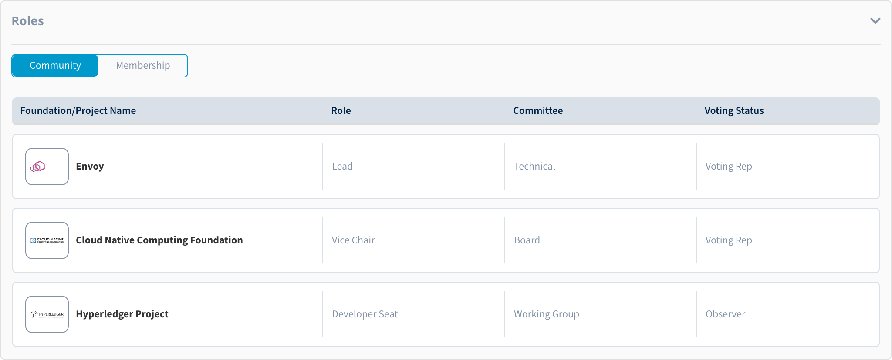

# View Roles

To view the roles you hold or have been elected to as an active member of the open source community login to [myprofile.linuxfoundation.org](https://myprofile.linuxfoundation.org/) and scroll down to the **Roles** section. 

The **Community** roles are populated from the community mailing lists like groups.io and you can view the following information for each role: 

* Foundation/Project Name for which you hold the role
* Role name, i.e. Lead, Vice Chair
* Committee Name 
* Your Voting Status associated with the role

If you are a contact on behalf of your company, which is a partner of the Linux Foundation and its projects, then your role in context of your employer's participation in the project is also displayed. These roles are assigned by your company administrator during the membership enrollment process.

