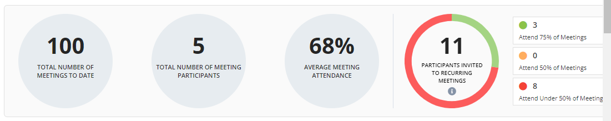
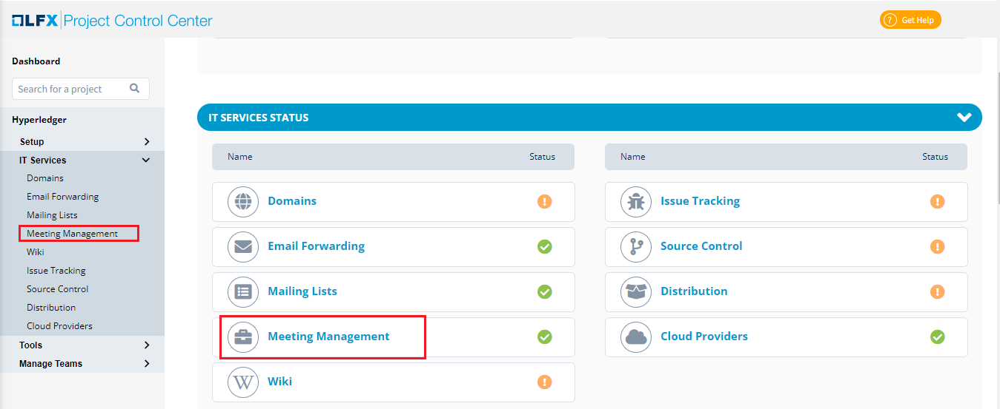
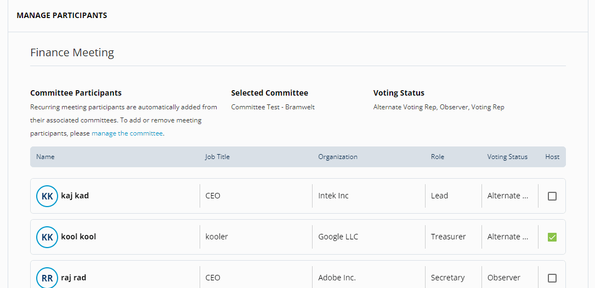

# Meeting Management

PCC allows you setup and manage meetings. You can schedule recurring and non recurring meetings among the teams. Meeting Management also  allows you to view  past meetings recordings, transcript copy of the meetings and also provides the option to share the recording with other team members.  PCC also provides a wizard that provides you a high level details related to the meetings.&#x20;

## Meeting Management Wizard&#x20;

The Meeting Management widget provides you the following details:

* Total number of past meetings till date
* Total number of participants in the meeting
* Average attendance of the meeting
* Participants invited to the recurring meetings

## Meetings&#x20;

You can view the meetings either in List View or in Calendar View. List view provides list of meetings that are scheduled and the Calendar view shows the scheduled meetings in a calendar.&#x20;

### Scheduling a Meeting&#x20;

Meeting Management allows you to schedule a recurring or a non recurring meetings. You can schedule a meeting and add participants belonging to various committees. You can also invite a private induvial who does not belong to any community. &#x20;

To schedule a meeting, perform the following:

1.Login into PCC.

2.Search for the required project. The Project dashboard appears. Click **Meeting Management** from the **IT SERVICES STATUS** tab.


You can also navigate to Meeting Management from the Vertical Sidebar navigation menu. Click **IT Services** and then select **Meeting Management**.


3.Click **+Add Recurring Meeting** if you want to add recurring meeting or **+ Add Non-Recurring Meeting** if you want to schedule non recurring meeting. &#x20;

4.The Schedule Meeting page appears. Update the following details and click **Next: Add Participants**.

| Field                        | Action                                                                                                                                                                                                                                    |
| ---------------------------- | ----------------------------------------------------------------------------------------------------------------------------------------------------------------------------------------------------------------------------------------- |
| Enter Meeting Title          | Enter the name of meting                                                                                                                                                                                                                  |
| Meeting Details              | Select the date and time for the meeting to be scheduled                                                                                                                                                                                  |
| Frequency of the meeting     | 
Select the required frequency of the meeting.   <em><strong>Note</strong></em>: If you are scheduling a non recurring meeting, you need to select <strong>Does Not Repeat</strong>. 
                                         |
| Meeting Visibility           | By default, all meeting will be private.  If you want to make the meeting public, you need to select the **Make Meeting Public**.                                                                                                         |
| Meeting Description          | Provide the description on the meeting                                                                                                                                                                                                    |
| Invite Committee Members     | Select the required committee for which the meeting is scheduled                                                                                                                                                                          |
| Recording and Transcription  | 
Select the recording visibility. You can either set the visibility of the meeting as Private or Public.    Select the transcript visibility.  You can either set the visibility of the transcription as Private or Public.  
 |

5.The Manage Participant page appears with list of committee members. The list provides details such as name of the member, job title of the member, organization to which the member belongs, role of the member, voting status. You can make the Host of the meeting by selecting the required member.&#x20;

Click **Schedule Meeting** to complete the meeting schedule.&#x20;


You can also invite a member who does not belong to the committee. Click **+ Add New Invite**. Enter the details such as name, company , email ID and job title  of the participant and click **Add Meeting Participant**. \
\
You can also add yourself to the meeting by clicking the **+ Add yourself to the meeting**. You can remove the participant by click of delete  icon&#x20;


## Past Meetings&#x20;

Past Meetings tab provides the list of meetings that were scheduled in the past. The list provides details such as meeting title, meeting date, number of attendees, recording and transcript of the meeting.&#x20;


You can share the recording and transcript of the meeting with the required members. This feature will be available in the upcoming releases.&#x20;


