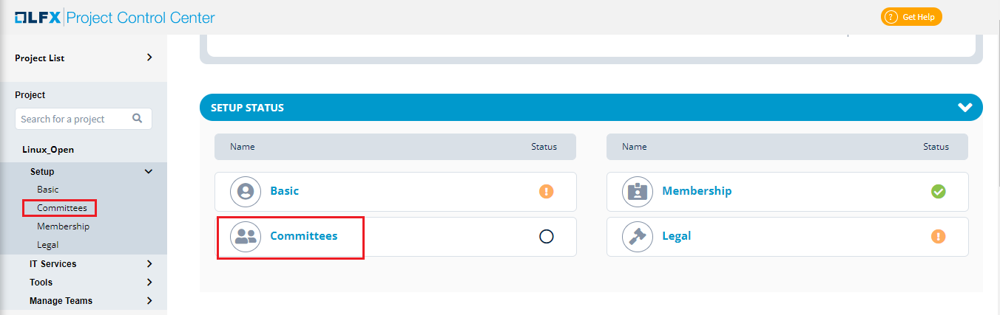

# Committees Setup for a Project

Committee setup of project allows you to provide information on:

* [Committee](committees-setup-for-a-project.md#billing-information)
* [Adding Members](committees-setup-for-a-project.md#adding-member-to-a-committee)
* [Deleting a Committee](committees-setup-for-a-project.md#deleting-a-committee)
* [Deleting a Member from a Committee](committees-setup-for-a-project.md#deleting-a-member-from-a-committee)
* [Manage Meetings](committees-setup-for-a-project.md#managing-meetings)
* [Manage Mailing List](committees-setup-for-a-project.md#managing-mailing-list)
* [Committee Overview](committees-setup-for-a-project.md#committee-overview)

## Committee 

You can add and update committee information related to the project such as name, mailing list, committee website, permissions and description.

To add a committee for a project, perform the following steps:

1.Click on the required project and click **Committees**.

2.The Committee page appears. Click **+Add Committee** to add the committee details.

3.The Create Committee page appears. Update the following details and click **Next** and click **Save** to create a committee.

| **Field**                       | **Action**                                                                                                                        |
| ------------------------------- | --------------------------------------------------------------------------------------------------------------------------------- |
| Add Committee Name              | Enter the name of the committee                                                                                                   |
| Description                     | Provide the description on the committee                                                                                          |
| Type                            | Select the type of committee that you want to create                                                                              |
| Enable Voting                   | Toggle the Enable Voting to enable the voting for the committee                                                                   |
| Committee Documentation/Website | Enter the committee website URL of the committee which can provide the committee details such as policies, meetings and schedules |


If you want to update the existing committee details, click the edit  icon.

If you want to delete the existing committee, click the delete icon.


### Adding Members to a Committee

After you setup the committee, you can add members to that committee who can exercise various responsibilities that are assigned to the members.

To add a member to a committee, perform the following steps:

1.Click on the required project and click **Committees**.

2.The Committees page appears with the list of committees that are created for the project. Click **Add** from the required committee where you want to add the members.

.png>)

4.The Add Committee Member dialog box appears. Update the following details and click **Save**:

| **Field**         | **Action**                              |
| ----------------- | --------------------------------------- |
| Name              | Enter the name of the member            |
| Email ID          | Enter the email ID of the member        |
| Company           | Enter the name of the company           |
| Job Title         | Enter the title for the member          |
| Appointed By      | Select the required appointed by        |
| Voting Status     | Select the required voting status       |
| Voting Start Date | Select the voting start date            |
| Voting End Date   | Select the voting end date              |
| Role              | Select the required role for the member |
| Role Start Date   | Select the role start date              |
| Role End Date     | Select the role end date                |


If you want to update the existing member details, click the edit  icon.

If you want to send an email to a member, click the mail  icon.



After adding a first member to a committee, if you want to add another member to a committee, you need to click the Committee and then click **Add Member** to add additional members to the committee.


## Deleting a Committee

You can delete a committee if you want to. Deleting a committee will also remove all the members added in the committee.

To delete a committee, perform the following steps:

1.Click on the required project and click **Committees**.

2\. You can see the list of committees that are created for the project. Click the  icon available under Manage tab and select Delete Committee.

3.The Delete Committee confirmation dialog box appears. Click **Delete** to delete the committee. A confirmation toast message appears informing that the committee has been deleted.

## Deleting a Member from a Committee

You can delete a member from a committee as and when required.

To delete a member, perform the following steps:

1.Click on the required project and click **Committees**.

2.You can see the list of committees that are created for the project. Click the committee from which you want to remove or delete a member from a committee.

3.The Committee page appears with list of members in it. Click the edit  icon

4.The Manage Committee Member dialog box appears. Click **Delete** to remove a member from the committee.

.png>)

## Managing Meetings

Meetings related to committees are listed in the committees list under **Upcoming Meetings** tab. You can see the scheduled meetings and as well as schedule a meeting. On click of **Schedule**, the page navigates to Meeting Management to schedule a meeting.

## Managing Mailing List

You can configure mailing list for your committees. On click of **Configure** available under **Mailing List**, the page navigates to **Mailing List**.

## Committee Overview

The Committee overview section provides the overview information on:

* Total number of committees formed for the project
* Total number of members added in the committees
* Percentage average meeting attendance of the committee members
* A donut chart that provides the number of committee members registered for the recurring meetings

