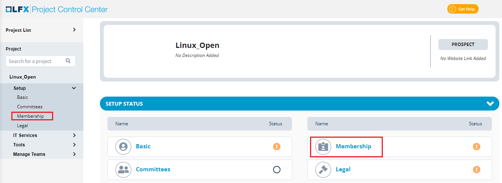

# Membership Setup for a Project

Membership setup of project allows you to provide information on:

* Membership Billing
* Membership Tier

## Membership Settings  

You  have to setup few parameters before you add Membership Tiers. You can add and update membership billing information related to the project such as auto renew, payment frequency, prorated information and invoicing.


Without updating the **Membership Settings**, the **+ Add Tier** will not be enabled.&#x20;


To add membership settings for a project, perform the following steps:

1.Click on the required project and click **Membership**.

2\. The Membership page appears. Click **Edit** to add the membership billing details.&#x20;

3.The Edit Membership Billing dialog box appears. Update the following details and click **Save**:

| **Field **          | **Action**                                                                                                |
| ------------------- | --------------------------------------------------------------------------------------------------------- |
| Auto Renew          | Select the required option to auto renew the membership billing. Click **Yes**, if you want to auto renew |
| Payment Frequency   | Select the required payment frequency for the membership billing                                          |
| Prorated Available  | Select the required option for the prorated membership billing                                            |
| Do Not Invoice      | Select the **Do Not Invoice** option, if you do not want the invoice for your membership billing          |


If you want to update the existing membership billing details, click the  edit  icon. &#x20;


## Membership Tier

You can add and update membership tier information related to the project such as name, pricing type, price point, membership term and description.

To add membership tier information for a project, perform the following steps:

1.Click on the required project and click **Membership**.

2.The Membership page appears. Click **+Add Tier **to add the membership tier details.

&#x20;

.png>)

3.The Add Membership Tier dialog box appears. Update the following details and click **Save**:&#x20;

| **Field**        | **Action**                                     |
| ---------------- | ---------------------------------------------- |
| Name             | Select the required membership type            |
| Pricing Type     | Select the required pricing type               |
| Price Points ($) | Enter the price points for the membership      |
| Membership term  | Select the required membership term            |
| Description      | Provide the description on the membership tier |

