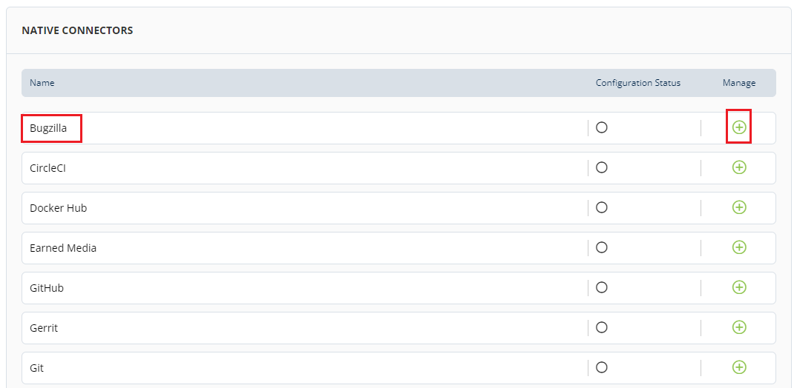

# Connecting Bugzilla

Bugzilla is used for bug tracking and for project management. If you are interested in getting an overview of issues and submitters in your projects, you can do so by connecting to Bugzilla.

To connect Bugzilla, perform the following:

1.Login to PCC.

2.Click **Insights** available under Tools dropdown menu.

3.The Native Connectors screen appears with list of available data connectors. Click  icon listed next to Bugzilla.

4.The Connector dialog box appears. Click **Connect**.

5.The Connect Bugzilla Account page appears. Click  icon to configure Bugzilla account and update the following details and click **Connect**.

| Field        | Action                                             |
| ------------ | -------------------------------------------------- |
| Bugzilla URL | Enter the Bugzilla URL that you want to configure. |
| Username     | Enter the username.                                |
| Password     | Enter the password.                                |

6.The connected Bugzilla account is listed under Configure Account, click **Save** to complete the Bugzilla connection.


The green dot under Instrumentation Status indicates that the Bugzilla account is enabled.


## Disabling Bugzilla Account

You can disable the connected Bugzilla account as per your requirement. You can enable or disable the account to suit your needs. Disabling an account does not remove the complete account information. It only puts the account in disabled mode.

To disable Bugzilla account, perform the following:

1.Use Toggle button available under Instrument.

2.The Disable Instrumentation dialog box appears. Click **Keep Data** to disable Bugzilla account.

.gif>)

## Deleting Bugzilla Account

You can delete the connected Bugzilla account permanently. Deleting a Bugzilla account will remove all the configured data.

To delete the Bugzilla account, perform the following:

1.Click the delete  icon available under Manage tab. The Disconnect Bugzilla URL appears, click **Disconnect**.

OR

2.User Toggle button. The Disable Instrumentation dialog box appears. Click **Remove Data** to delete Bugzilla account.

