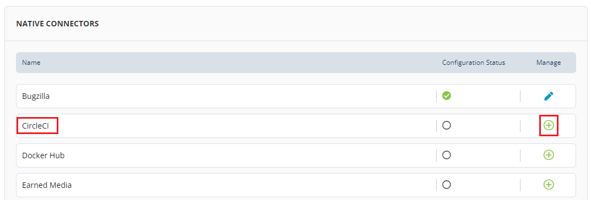

# Connecting CircleCI

CI/CD \*\*\*\* dashboards show continuous integration, build and job analytics for the project.

To connect CircleCI, perform the following:

1.Login to PCC.

2.Click **Insights** available under Tools Status.

3.The Native Connectors screen appears with list of available data connectors. Click  icon listed next to CircleCI.

4.The Connector dialog box appears. Click **Connect**.

5.The Connect Bugzilla Account page appears. Click .png>) icon to configure CircleCI account and update the following details and click **Connect**.

| Field        | Action                                            |
| ------------ | ------------------------------------------------- |
| CircleCI URL | Enter the CirceCI URL that you want to configure. |

6.The connected CircleCI account is listed under Configure Account, click **Save** to complete the CircleCI connection.


The green dot under Instrumentation Status indicates that the CircleCI account is enabled.


## Disabling CircleCI Account

You can disable the connected CircleCI account as per your requirement. You can enable and disabled the account as per you needs. Disable of account does not remove the complete account information, it is only in disabled mode.

To disable CircleCI account, perform the following:

1.Use Toggle button available under Instrument.

2.The Disable Instrumentation dialog box appears. Click **Keep Data** to disable CircleCI account.

## Deleting CircleCI Account

You can delete the connected CircleCI account permanently. Deleting a CircleCI account will remove all the configured data.

To delete the CircleCI account, perform the following:

1.Click the delete  icon available under Manage tab. The Disconnect CircleCI URL appears, click **Disconnect**.

OR

2.User Toggle button. The Disable Instrumentation dialog box appears. Click **Remove Data** to delete CircleCI account.
