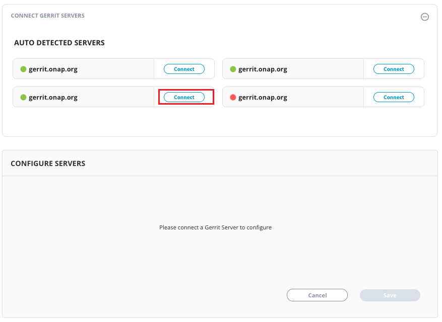

# Connecting Gerrit

The Gerrit Changesets dashboards represent a set of metrics that shows detailed information about changesets and patchsets per changeset.

To connect Gerrit, perform the following:

1.Login to PCC.

2.Click **Insights** available under Tools dropdown menu.

3.The Native Connectors screen appears with list of available data connectors. Click  icon listed next to Gerrit.

4.The Connector dialog box appears. Click **Connect**.

5.The Auto Detected Servers page appears with a list of auto detected Gerrit servers. Click Connect from the required Gerrit servers.


The green dot under Instrumentation Status indicates that the Gerrit account is enabled.


## Disabling Gerrit Account

You can disable the connected Gerrit account as per your requirement. You can enable or disable the account to suit your needs. Disabling an account does not remove the complete account information. It only puts the account in disabled mode.

To disable Gerrit account, perform the following:

1.Use Toggle button available under Instrument.

2.The Disable Instrumentation dialog box appears. Click **Keep Data** to disable the account.

## Deleting Gerrit Account

You can delete the connected Gerrit account permanently. Deleting a Gerrit account will remove all the configured data.

To delete the Gerrit account, perform the following:

1.Click the delete  icon available under Manage tab. The Disconnect Gerrit URL appears, click **Disconnect**.

OR

2.User Toggle button. The Disable Instrumentation dialog box appears. Click **Remove Data** to delete Gerrit account.
