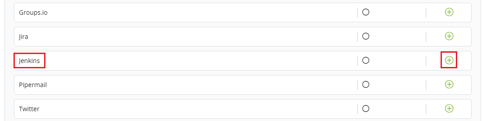

# Connecting Jenkins

The Jenkins dashboards under CI/CD drop-down list represents a set of metrics that show overview analysis of Jenkins data.&#x20;

To connect Jenkins, perform the following:

1.Login to PCC.&#x20;

2.Click **Insights** available under Tools Status.&#x20;

3.The Native Connectors screen appears with list of available data connectors. Click  icon listed next to Jenkins.&#x20;

4.The Connector dialog box appears. Click **Connect**.&#x20;

5.The Connect Jenkins Public URL page appears. Click  icon to configure Jenkins, update the following details and click **Connect**.

| Field       | Action                    |
| ----------- | ------------------------- |
| Jenkins URL | Enter valid Jenkins URL.  |

6.The connected Jenkins account is listed under Configure Account, click **Save** to complete the Jenkins configuration.&#x20;


The green dot under Instrumentation Status indicates that the Jenkins is enabled.


## Disabling Jenkins Account

You can disable the connected Jenkins as per your requirement. You can enable and disabled the account as per you needs. Disable of account does not remove the complete account information, it is only in disabled mode.

To disable Jenkins, perform the following:

1.Use Toggle button available under Instrument.&#x20;

2.The Disable Instrumentation dialog box appears. Click **Keep Data** to disable Jenkins  account.&#x20;

## Deleting Jenkins Account&#x20;

You can delete the connected Jenkins account permanently. Deleting a Groups.io account will remove all the configured data.&#x20;

To delete the Jenkins account, perform the following:

1.Click the delete  icon available under Manage tab. The Disconnect Jenkins URL appears, click **Disconnect**.&#x20;

&#x20;                            OR

2.User Toggle button. The Disable Instrumentation dialog box appears. Click **Remove Data** to delete Jenkins account.&#x20;

