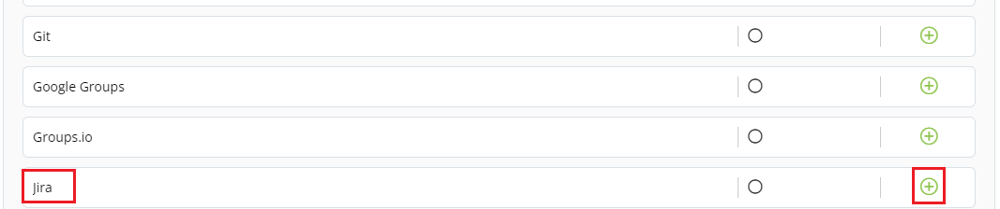

# Connecting Jira

The Jira dashboards under Issue Management \*\*\*\* represents a set of metrics that shows an analysis of Jira issues.

To connect Jira, perform the following:

1.Login to PCC.

2.Click **Insights** available under Tools dropdown menu.

3.The Native Connectors screen appears with list of available data connectors. Click  icon listed next to Jira.

4.The Connector dialog box appears. Click **Connect**.

.png>)


You should have setup Issue Tracking in the IT Services. Click **Configure on IT Services**.

For more information on how to setup Mailing List, refer [Mailing List](https://docs.linuxfoundation.org/lfx/project-control-center-pre-release/it-services-for-a-project/mailing-list) Documentation.


5.The Connect Jira page appears. Click .png>) icon to configure Jira and update the following details and click **Connect**.

| Field              | Action                                                        |
| ------------------ | ------------------------------------------------------------- |
| Jira               | Enter a valid Jira URL. |

6.The connected Jira is listed under Configure Account, click **Save** to complete the Jira.


The green dot under Instrumentation Status indicates that the Jira is enabled.


## Disabling Jira Account

You can disable the connected Jira account as per your requirement. You can enable or disable the account to suit your needs. Disabling an account does not remove the complete account information. It only puts the account in disabled mode.

To disable Jira, perform the following:

1.Use Toggle button available under Instrument.

2.The Disable Instrumentation dialog box appears. Click **Keep Data** to disable Jira account.

## Deleting Jira Account

You can delete the connected Jira account permanently. Deleting a Jira account will remove all the configured data.

To delete the Jira account, perform the following:

1.Click the delete  icon available under Manage tab. The Disconnect Jira URL appears, click **Disconnect**.

OR

2.User Toggle button. The Disable Instrumentation dialog box appears. Click **Remove Data** to delete Jira account.
