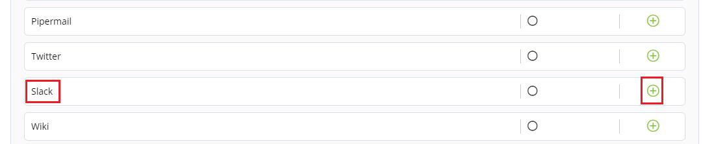
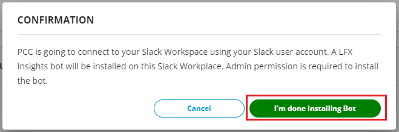

# Connecting Slack

The slack dashboard is available from the Chat Room drop-down list, and represents a set of metrics that shows information about the slack communication channel.

To connect Slack, perform the following:

1.Login to PCC.&#x20;

2.Click **Insights** available under Tools Status.&#x20;

3.The Native Connectors screen appears with list of available data connectors. Click  icon listed next to Slack.&#x20;

4.The Connector dialog box appears. Click **Connect**.&#x20;

5.The Connect Slack Workspace page appears. Click  icon to configure Slack, update the following details and click **Connect**.

| Field                        | Action                            |
| ---------------------------- | --------------------------------- |
| Slack Workspace Endpoint URL | Enter valid Slack Workspace URL.  |

6\. A Confirmation dialog box appears which informs that about installing Insights bot. Click Install Bot.&#x20;

7\. The Insights Bot gets installed and click **I'm done installing Bot**.&#x20;


The green dot under Instrumentation Status indicates that the Slack is enabled.


## Disabling Slack Account

You can disable the connected Slack account as per your requirement. You can enable and disabled the account as per you needs.  Disable of account does not remove the complete account information, it is only in disabled mode.

To disable Slack account, perform the following:

1.Use Toggle button available under Instrument.&#x20;

2.The Disable Instrumentation dialog box appears. Click **Keep Data** to disable Slack account.&#x20;

## Deleting Slack Account&#x20;

You can delete the connected Slack account permanently. Deleting a Slack account will remove all the configured data.&#x20;

To delete the Slack account, perform the following:

1.Click the delete  icon available under Manage tab. The Disconnect Slack URL appears, click **Disconnect**.&#x20;

&#x20;                            OR

2.User Toggle button. The Disable Instrumentation dialog box appears. Click **Remove Data** to delete Slack account.&#x20;
