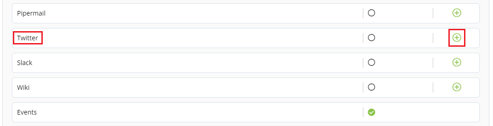
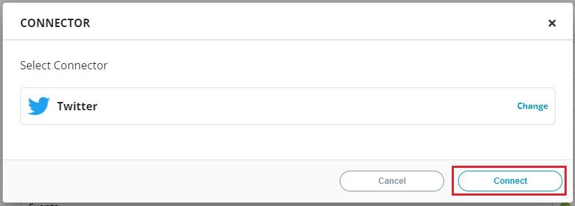

# Connecting Twitter

It displays key metrics related to the project’s Twitter accounts.&#x20;

To connect Twitter, perform the following:

1.Login to PCC.&#x20;

2.Click **Insights** available under Tools Status.&#x20;

3.The Native Connectors screen appears with list of available data connectors. Click  icon listed next to Twitter.&#x20;

4.The Connector dialog box appears. Click **Connect**.&#x20;

5.The Connect Twitter URL page appears. Click  icon to configure Twitter, update the following details and click **Connect**.

| Field                   | Action                           |
| ----------------------- | -------------------------------- |
| Project Twitter Handle  | Enter valid Twitter handle URL.  |

.png>)

6.The connected Twitter account is listed under Configure Account, click **Save** to complete the Twitter configuration.&#x20;


The green dot under Instrumentation Status indicates that the Twitter is enabled.


## Disconnecting Twitter&#x20;

You can disconnect added Twitter.&#x20;

To delete the Twitter, perform the following:

1.Click **Disconnect**.&#x20;

.png>)

2.The Disconnect Twitter Handle dialog box appears. Click **Disconnect** Twitter.

