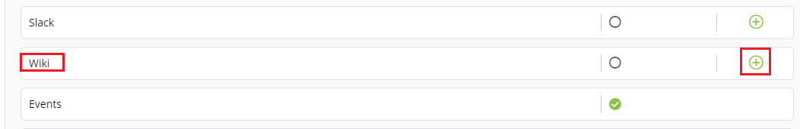

# Connecting Wiki

Atlassian _Confluence_ is a content tool that teams use to collaborate and share knowledge. Confluence lets users create pages and blogs, which all team members can comment on and edit.&#x20;

To connect Confluence Wiki, perform the following:

1.Login to PCC.&#x20;

2.Click **Insights** available under Tools Status.&#x20;

3.The Native Connectors screen appears with list of available data connectors. Click  icon listed next to Wiki.&#x20;

4.The Connector dialog box appears. Click **Connect**.&#x20;


You should have setup Issue Tracking in the IT Services. Click **Configure on IT Services**.&#x20;

For more information on how to setup Mailing List, refer [Setting up Wiki](https://docs.linuxfoundation.org/lfx/project-control-center-pre-release/it-services-for-a-project/setting-up-wiki) Documentation.&#x20;


5.The Wiki page appears. Click  icon to configure Wiki and update the following details and click **Connect**.

| Field  | Action                                                          |
| ------ | --------------------------------------------------------------- |
| Conflu | Enter valid google group URL or valid email ID of the group  .  |

6.The connected Jira is listed under Configure Account, click **Save** to complete the Jira.&#x20;


The green dot under Instrumentation Status indicates that the Jira is enabled.


## Disabling Jira Account

You can disable the connected Jira as per your requirement. You can enable and disabled the account as per you needs. Disable of account does not remove the complete account information, it is only in disabled mode.

To disable Jira, perform the following:

1.Use Toggle button available under Instrument.&#x20;

2.The Disable Instrumentation dialog box appears. Click **Keep Data** to disable Jira account.&#x20;

## Deleting Jira Account&#x20;

You can delete the connected Jira account permanently. Deleting a Jira account will remove all the configured data.&#x20;

To delete the Jira account, perform the following:

1.Click the delete  icon available under Manage tab. The Disconnect Jira URL appears, click **Disconnect**.&#x20;

&#x20;                            OR

2.User Toggle button. The Disable Instrumentation dialog box appears. Click **Remove Data** to delete Jira account.&#x20;

