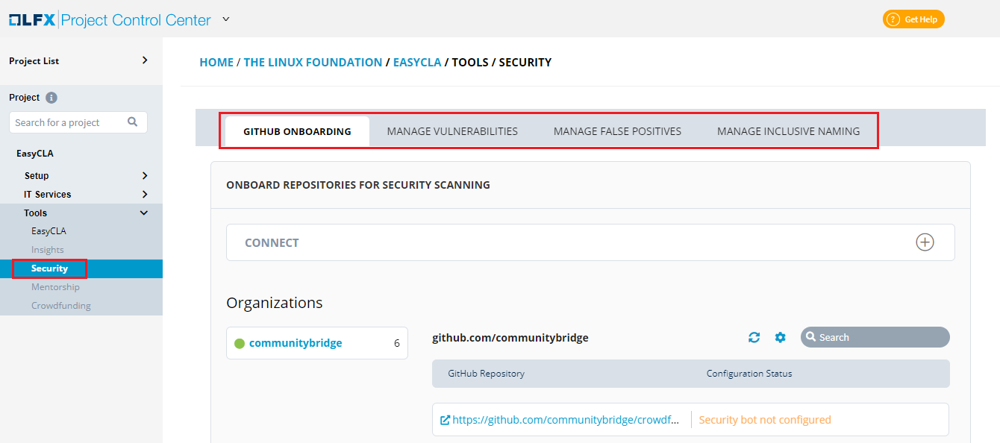

# Security

The LFX Security tool provides automated vulnerability scanning and provides visibility into potential vulnerabilities to help projects address top security concerns.

The Security service tool allows you to perform the following:

* GitHub Onboarding
* Manage Vulnerabilities
* Manage False Positives
* Manage Inclusive Naming

For more information on Security Services, visit [Security Documentation](https://docs.linuxfoundation.org/lfx/security).

