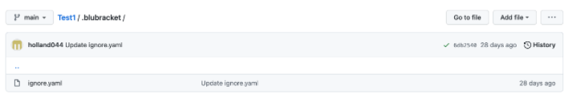

# Ignore.yml File

In certain scenarios, if the administrator wants to ignore specific secret types, secret values, or paths, they can do so by creating an ignore.yaml file. On creating the ignore.yaml file, the file should be placed into the root directory of the repository, within a .blubracket folder.

When a match of the ignore file is made, an alert will not be created (but an event will still be generated).

Example below is a repository called Test1, which has a .blubracket folder and within the folder is the ignore.yaml file.



A sample .blubracket/ignore.yaml is provided below:

```
Ignore by file path
- paths:
    - "**/*_test.go"
    - cli/cmd/default-sensitive-words-config.yaml
    - cli/cmd/data/*

# Ignore by secret value
# Equivalent to 'secret_value == my_password OR secret_value == my_token'
- secret_values:
    - my_password
    - my_token

# Ignore by secret type
# Equivalent to 'secret_type == password_assignment OR secret_type == secret_assignment'
- secret_types: password_assignment
```

Content Credit from [Blubracket Article](https://support.blubracket.com/hc/en-us/articles/4408108989076-Repository-ignore-yaml-file).&#x20;
