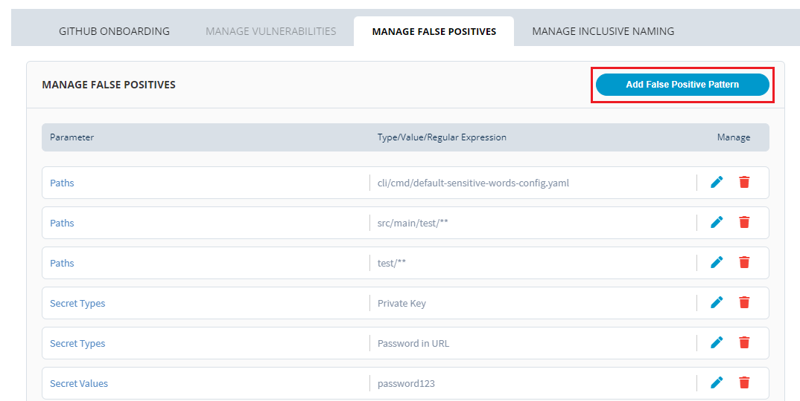
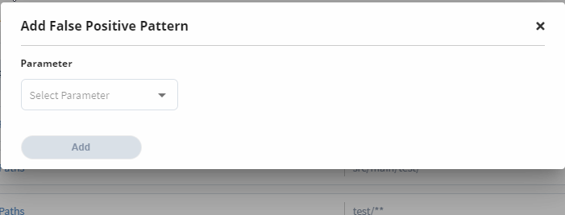

# Manage False Positives

Manage false positives allows you to define few parameters and assign values to them which can be used to signal false positive at the time of scanning for code secrets. When you define a parameter as a false positive, you can easily detect these 

## Adding a False Positive Pattern 

PCC Security tool allows you to add a false positive parameter which allows the 

To add a false positive pattern, perform the following steps:

1.Login into [PCC](https://projectadmin.lfx.linuxfoundation.org).

2\. Search for the required project. The Project dashboard appears. Click **Security** from the **TOOLS STATUS** tab.


You can also navigate to Security from the Vertical Sidebar navigation menu. Click **Tools** and then select **Security**.


3.The Security page appears. From the **Manage False Positive** tab, click **Proceed**.

4.The Manage False Positive page appears with the list of defined false positive parameters. Click **Add False Positive Pattern **to add a new false positive parameter. 


* You can delete the existing false positive parameter by click of delete  icon. 
* You can update the existing false positive parameter by click of edit  icon.  


5.The Add False Positive Pattern dialog box appears. There are three parameters that are available for you to select and define. After defining the parameter,  click **Add **to add the parameter as false positive. The three parameters are:

* **Path **- Define the path for which you want to flag 
* **Secret Type** - You can select the required secret type from the drop-down list. Some of the secret types are password assignment, JWT toke, AWS key and many other secret types are available for your to select. 
* **Secret Value** - You should use a regular expression in order to define a value for Secret Value. 


 A regular expression (regex or regexp) is a sequence of characters that specifies a search pattern. Usually such patterns are used by string-searching algorithms for "find" or "find and replace" operations on strings, or for input validation. For more information, refer [Regular Expressions](https://www.debuggex.com/cheatsheet/regex/pcre). 


