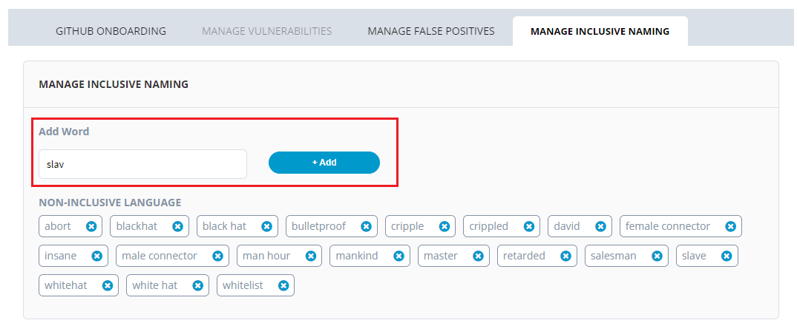
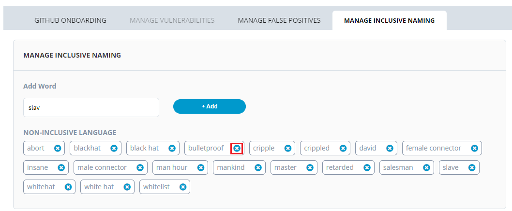
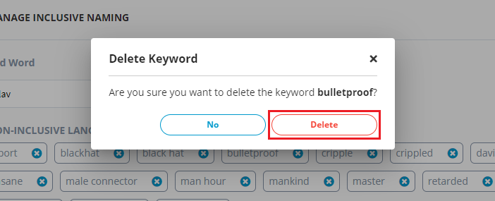

# Manage Non Inclusive Naming

## Adding Non Inclusive Words 

You can add the words which depict people unfairly in an insulting manner and exclude people based on their ethnicity, gender or color. LFX will scan for these non inclusive words in the code. You refer Non Inclusive Language section for more information.

To add non inclusive words, perform the following steps:

1.Login into [PCC](https://projectadmin.lfx.linuxfoundation.org/).

2. Search for the required project. The Project dashboard appears. Click **Security** from the **TOOLS STATUS** tab.


You can also navigate to Security from the Vertical Sidebar navigation menu. Click **Tools** and then select **Security**.


3.The Security page appears. From the **Manage Inclusive Naming** tab, click **Proceed**.

4.Enter the non inclusive word in the **Add word** box and click **+Add**. The added non inclusive words are listed under NON-INCLUSIVE LANGUAGE.

## Deleting Non Inclusive Words

To delete a non inclusive word, perform the following steps:

1.From the **Manage Inclusive Naming** tab, click  icon that you want to delete from the list. 

2. The Delete Keyword dialog box appears. Click **Delete** to confirm the deletion of the word. 

