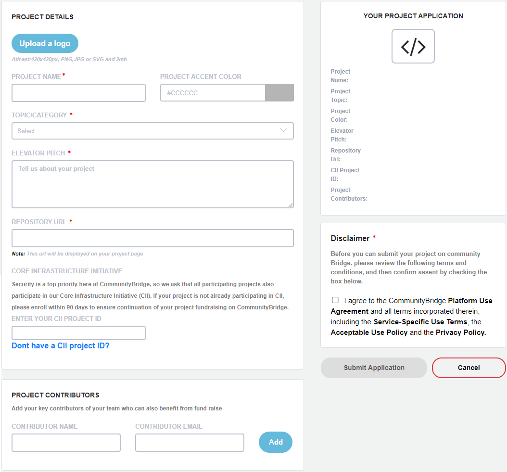

# Add a GitHub/Git Project to LFX Security

As a project maintainer, you must submit an application to add a GitHub open source project or Git repository to LFX Security. LFX Security requires access to your code repository to support security vulnerability scanning. The application process requires you to authenticate your GitHub ID or Git ID to grant Security read-only access to the repositories you maintain.

Have these items handy before you begin:

* The URL for your code of conduct (the rules of behavior for the members of that group or organization).
* A logo file that represents your project in JPG, PNG, SVG format with a maximum size of 2 MB.
* A list of names and email addresses of individuals who are authorized to view the details of your project's scans.

**Do these steps:**

1.[Sign In](../../sso/sign-in/) to [LFX Security](https://security.lfx.linuxfoundation.org) and click **Secure My Project**.

2\. "Ready to solve your funding, security and growth challenges?" appears. Click **Sign up**.

3.The Project Details page appears with a project application that lets you provide information about your project.

4.Complete the form fields. Red asterisks indicate mandatory required fields.

5\. Read the disclaimer and if you agree, select the disclaimer and click **Submit Application**. See [Project Application Form](../../crowdfunding/project-application.md) for information about fields that require explanation.

6\. Click **My Projects** to see your pending project.
