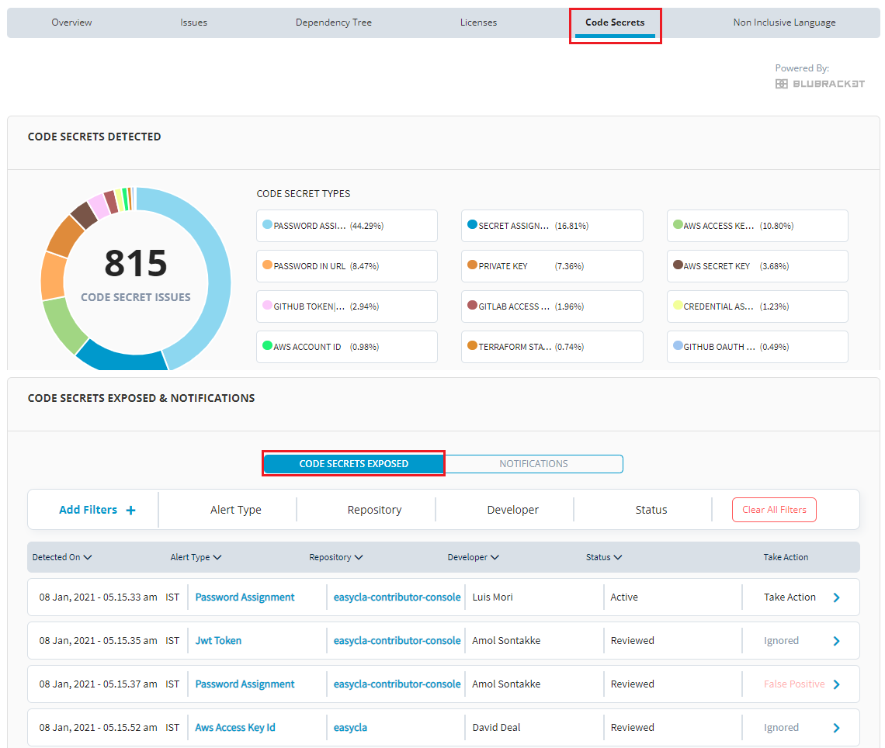

# Code Secrets

LFX Security has collaborated with BluBracket to scan for valuable private information and non-inclusive words in open source code, we call this information “code secrets”. Unearthing code secrets has made the open source projects more secure and the code security is enhanced to a great extent by detecting and monitoring the risks thus improving the code.

## Code Secrets Detected

Code Secrets Detected donut chart provides you the number of code secrets detected in the project. It shows you various code secrets detected in the project. On click of the detected code secret, the page navigates to the Code Secret details page.

 (1) (1) (1).gif>)

## Scanning of Projects for Code Secrets 

After onboarding the projects, scanning of projects for code secrets is carried out by LFX Security platform. The LFX Security platform will scan the repositories and detect the code secrets and notifications for the selected organization or repository.

### Project Code Secrets 

LFX Security will scan the repositories and organizations for code secrets such as passwords, JWT tokens, AWS access keys, terraform state file and non enterprise webhooks.

To access code secrets for a project or repository, perform the following steps:

1.Login to [LFX Security](https://security.lfx.linuxfoundation.org) and select the required project and click **View Dashboard**.

.png>)

2.Select **Code Secrets** from the top menu. The Code secrets are listed under the **CODE SECRETS EXPOSED** tab.

3\. The list provides the following details related to the code secrets:

* **Detected On**- Date and time when the code secret is detected
* **Alert Type**- Type of code secret that is been detected
* **Repository** - Name of the repository which contains the code from where the code secret has been detected
* **Developer** - Name of the developer who has checked in the code in the repository
* **Status** - Status of the code secret whether the code secret has been resolved or reviewed
* ​**Take Action** - Allows you to take action on the code secrets.


You should have the necessary permission to take action on the code secrets. With out necessary permissions, the **Take Action** tab will not be available to take action on code secrets.


### Code Secret Details 

The Code Secrets Revealed tab provides you the list of code secrets associated with the project or repository. You can check the details of the listed code secret with the help of **Take Action** tab.

To check the details related to the listed code secrets, perform the following steps:

1.Select **Code Secrets** from the top menu. The Code secrets are listed under the **CODE SECRETS REVEALED** tab.

2\. Click the icon listed in front of Take Action.

3\. The code secret details box appears with a list of all the details related to the code secret. The following details are available for you to check out:

* File Details
  * Name - A hyperlink that will navigate you to the exact line of the code which is a potential threat or vulnerability.
  * Private Key - The code secret that was identified in the file. The value is masked such that it doesn’t show the exposed code secret value. To see the code secret, click on the filename or the commit ID.
  * Secret Hash - The hash ID value for the code secret.
* Repository Details
  * Organization - Name of the GitHub organization.
  * Provider - Name of the provider where the code is hosted.
  * Description - A short info on the organization.
* Commit Details
  * Commit ID - A hyperlink that will navigate you to the ID who has checked in the code.
  * Time - Date and time when the code is checked in.
  * Committed By - Name of the developer who has checked in the code.
  * Message - This is the message associated with the git commit when the code secret was introduced into the repository. This may provide a hint as to why the code secret was added or which bug fix or feature enhancement is associated with the change.

### Actions Performed on the Code Secrets 

Project Maintainers can perform various actions on the code secrets. These actions will help to mitigate the vulnerabilities for the code and the project. The icon provides you all the required details related to the code secrets, based on the details available, you can perform certain actions on these code secrets.

To perform actions on the code secrets, perform the following steps:

1.Select **Code Secrets** from the top menu. The Code secrets are listed under the **CODE SECRETS REVEALED** tab.

2\. Click the  icon listed in front of Take Action.

3\. The code secret details box appears with a list of all the details related to the code secret. Click **Actions** and select the required action to be performed for the listed code secret.

4.Under **Actions**, you can see the following actions:

* Resolve - Use this option to resolve the code secret
* Ignore - Use this option to ignore the code secret
* False Positive - Use this option if you think the mentioned code secret is not a code secret

### Categorization of Code Secrets 

LFX Security allows you to categorize the code secrets using various parameters. Following are few of the categories available to filter or categorize code secrets:

* Alert Type
* Repository
* Developer

To add filter, perform the following:

1.Click **Add Filters +** and select the required filters and click **Apply Filters**.

## Scanning of Projects for Notifications 

Code secrets will provide generic notifications related to the repositories. These notifications are generic notifications which are not fatal even if ignored. These notifications will provide information to the project maintainers on their projects and repositories.

Few of the notifications provided by code secrets are:

* Web hook URL non enterprise
* Repo forked
* Users edited in the repo

### Code Secret Notifications 

LFX Security will scan the repositories and organizations and provide various notifications related to them.

To access code secrets notifications for a project or repository, perform the following steps:

1.Login to [LFX Security](https://security.lfx.linuxfoundation.org) and select the required project and click **View Dashboard**.

2.Select **Code Secrets** from the top menu. The Code secrets notifications are listed under the **NOTIFICATIONS** tab.

3.The list provides the following details related to the code secrets notifications:

* **Detected On**- Date and time when the code secret notification is detected
* **Event Type** - Type of code secret notification that is been detected
* **Repository** - Name of the repository which contains the code from where the code secret notification has been detected
* **Developer** - Name of the developer who has checked in the code in the repository
* ​ - Icon to minimize and maximize the code secret details.

### Code Secret Notification Details 

The Notifications tab provides you the list of notifications associated with the project or repository. You can check the details of the listed notification with the help of the  icon.

To check the details related to the listed notification, perform the following steps:

1.Select **Code Secrets** from the top menu. The Code secret notifications are listed under the **NOTIFICATION** tab.

2\. Click the  icon listed in front of the notification.

3\. The notification details box appears with a list of all the details related to the notification. The following details are available for you to check out:

* Repository - Name of the repository
* Repo URL - URL of the repository
* Source Repo URL - Source URL of the repository

### Filter of Notifications through Event Type 

You can filter the notifications based on the event types.

To add filter, perform the following:

1.Click **Add Filters +** and select the required filters and click **Apply Filters**.

