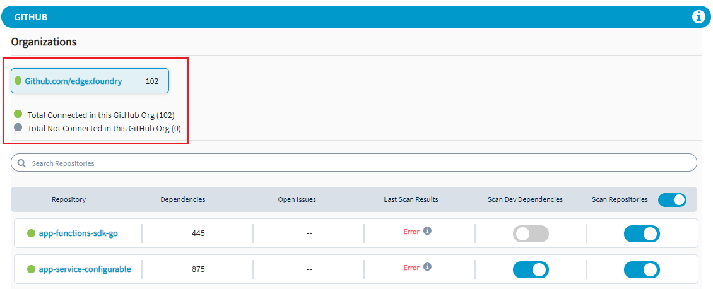

# Enable or Disable Scanning for a Repository

From Settings tab, you can perform the following tasks:

* Enable or disable vulnerability and code secret scanning for a repository to refine scanning report of the project.
* Auto enabling repositories for scanning vulnerabilities and code secrets.
* Adding non inclusive words to scan from the code.

## **Enable/Disable a Repository for Vulnerability Scan**

You can enable or disable a repository for vulnerability scanning in the Settings tab. If you enable a repository for vulnerability scanning, the repository is scanned for the vulnerabilities. If you disable the vulnerability scanning for a repository, the scanning will be skipped for the selected repository and vulnerabilities will not be detected.  

To enable or disable a repository for vulnerability scan, perform the following steps:

1.Select **Settings** from the menu.  
All repositories of the project are listed in alphabetical order. 

2.Under **Scan Repositories** tab, toggle **scan** button to enable or disable a repository from scanning. 


You can also enable or disable scanning for all repositories by toggle of **Scan Vulnerabilities**. 


3.Under **Scan Dev Dependencies** tab, toggle scan button to enable or disable dev dependency scan.

 4.Under **Last** **Scan Results** tab, you can see whether the repository scan has been successful or where there were any errors while scanning the repository.

When the scan of the repository is successful, it is displayed as **Successful** and if there are any errors, it will be displayed as **Error**.


The error details for the repository is displayed when you click the  icon. 

An error will be displayed when the language used in the repository is not supported by Security scan.


5.You can also see the open issues related to the repository under **Open Issues** tab.

6.You can also click on the **Total Connected/Not Connected** repositories that are connected to the GitHub org.  This will provide the details of the repositories that are connected or not connected.  

This provides the status of repositories within the GitHub Org, if the repositories are accessible or not.

