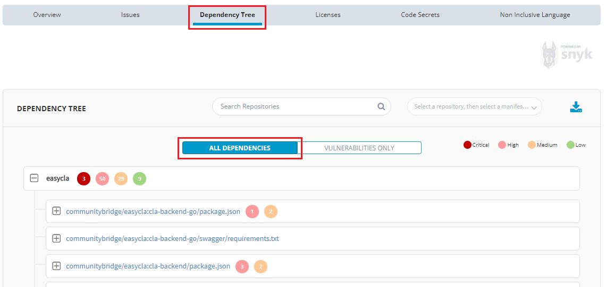
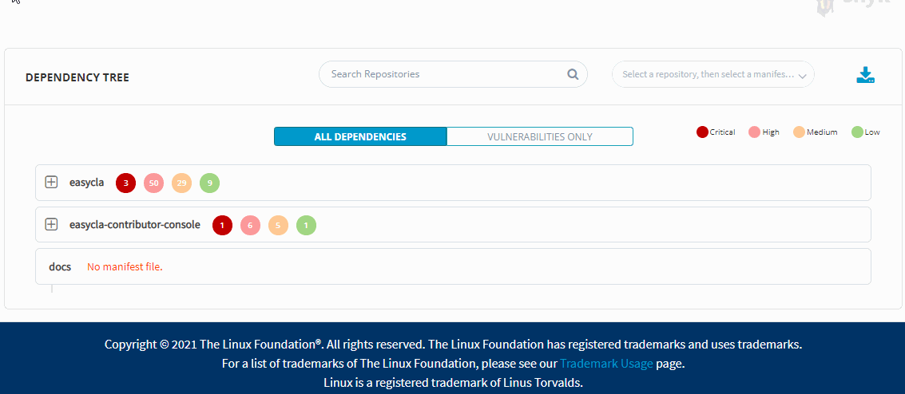
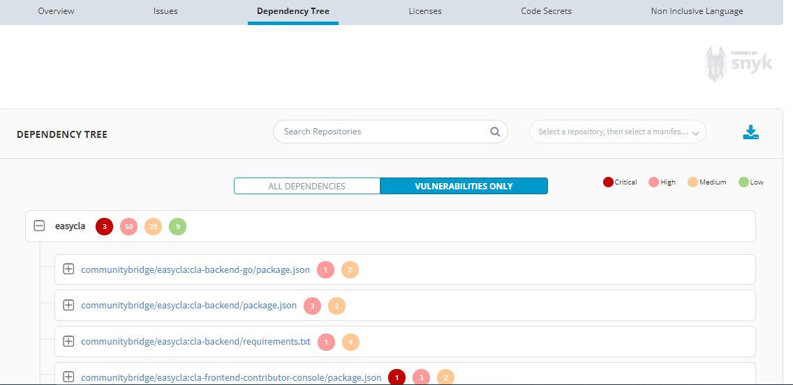

# Investigate Dependencies in the Application Dependency Tree

LFX Security looks for vulnerabilities in your open-source dependencies and identifies the vulnerabilities. The Dependency Tree dashboard provides detailed information about any dependencies in a repository and maps the full application dependency tree. You can view details about a specific dependency and see which repositories are using it. The way the repository uses a dependency affects the problem severity level.

Vulnerabilities can be caused by either direct or deep dependencies.

* A direct dependency is a package that you have included in your own repository.
* A deep (indirect) dependency is a package that you are not using directly, but one that is used by one of your direct dependencies. For example, if your application is using package A, and package A is using package B, then your application is indirectly depending on package B. And if package B is vulnerable, your project is vulnerable.

As an open-source developer, you should understand the direct and indirect dependencies your repositories and projects use, including any security flaws that might exist in the dependency tree. LFX Security determines all the paths through the dependency tree in which a vulnerable dependency can be reached, and identifies the vulnerability.

## All Dependencies

To view all dependencies, perform the following:

1.Select **Dependency Tree** from the top menu and click **All Dependencies**.

A snapshot of dependencies in the repository in a tree format of the dependencies appears. The tree repository order is descendant from the greatest number of dependencies in a repository to the least number. Each item (a branch or a node) can have a number of subitems. By default, the first three levels appear. Expand nodes of interest to drill down in the tree.

2\. You can select a **repository** from the Repository drop-down list or select using a **Manifest** file from the Manifest drop-down list. Only dependencies for the selected repository or manifest file for the selected project appear.


Click the download  icon to download the dependency CSV file.


3.Navigate the tree to identify vulnerable dependencies in the repository. The issues are categorized for different Manifest files. The Manifest file lists the node level and child level dependences.

Each repository shows you the number of issues in the repository along with the criticality of the issue. Each criticality is defined with a different color.

A View button is available at the deeper level to go ahead and check the issue details. The color of the button will also indicate the criticality of the issue.

A icon  (1).png>) is also available which suggests that there are issues still available further in the child level dependencies.

4.Click a **license** of interest to go to SPDX and find out more information about a license. The SPDX License includes a full name, standardized short identifier, vetted license text, and other information about the license.

## Vulnerability Details

You can also check the vulnerability details only for a particular repository.

To check the vulnerability details only, perform the following steps:

1.Click **Dependency Tree** and select **Vulnerabilities Only**.


Click the download  icon to download the vulnerabilities CSV file.


2\. List of vulnerabilities related for a particular repositories or Manifest file are listed. The rest of the details related to issues is similar to what is explained under All Dependencies Section.

