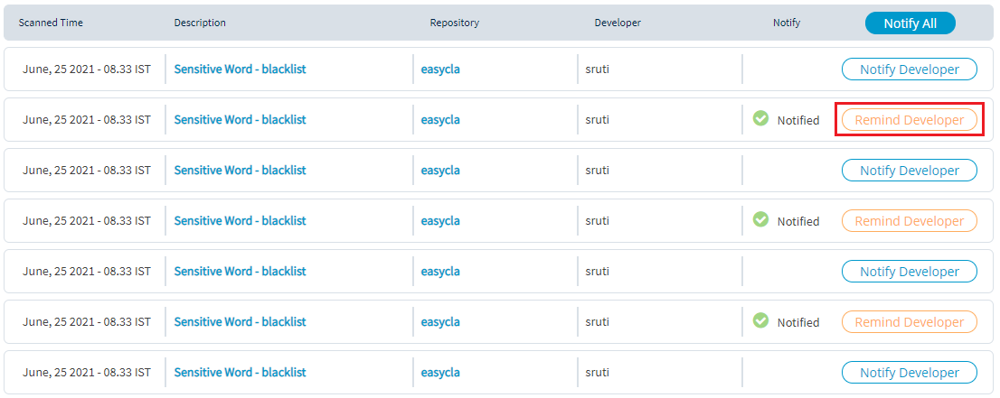

# Non Inclusive Language

LFX Security with the BluBracket collaboration scans for non inclusive language which is used in the code. Non inclusive language is usage of language where people are unfairly treated, insulted and people are excluded based on their ethnicity, gender or color. Usage of these words or language is not expected and unethical to use in the open source code. 

LFX Security will scan for the non inclusive language  which might have been added by the developers unintentionally without their knowledge. Some of the genetic non inclusive language that are used in the code are blacklist, whitelist, slave, master. 

To view non inclusive language, perform the following steps:

1.Login to [LFX Security](https://security.lfx.linuxfoundation.org/) and select the required project and click **View Issues**.

2.Select **NON-INCLUSIVE LANGAUGE** from the top menu.

3.The list provides the following details related to the non inclusive language:

* **Scanned Time** - Date and time when the code is scanned
* **Description**  - Non inclusive language used in the code
* **Repository**  - Name of the GitHub repository which contains the code from where the non inclusive language has been detected
* **Developer** - Name of the developer who has checked in the code in the repository
* **Notify** - Notification button which can be used to notify the developer


When you click on the Description of the non inclusive language, you will be navigated to the line of the code where non inclusive language has been used. 


## Notifying Developer 

You have an option to notify the developer who as used the non inclusive language in their code. This notification feature will allow the developer to remove or replace the non inclusive language. 

To notify a developer on usage of non inclusive language, perform the following steps:

1.Select **NON-INCLUSIVE LANGAUGE** from the top menu.

2.Under Notify tab, click **Notify Developer**. A notification email is delivered to developer who has added the non inclusive language. 


You can see **Notified** along with a green tick mark when a notification is sent to the developer. 


3.You can also send a reminder notification to the developer if the developer as not replaced the non inclusive language even after send a notification. Click **Remind Developer** to send a reminder notification. 

 

