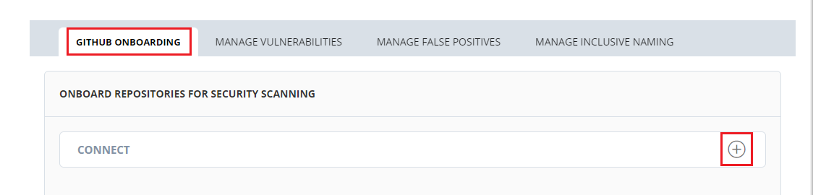

# Onboarding your Project

You have to onboard your project from GitHub to use LFX Security services. First you need to onboard your project to start scanning for vulnerabilities detection, code secrets and non inclusive language.

Onboarding projects into LFX Security is done from the PCC (Project Control Center). As part of this onboarding a Security Bot is installed on GitHub Organizations of the project.


You need to raise a ticket if you do not have access to PCC. Use this [link ](https://jira.linuxfoundation.org/plugins/servlet/theme/portal/4/create/358)to raise a support ticket to access PCC.

If you want to know more about PCC, please visit [PCC ](https://lfx.linuxfoundation.org/tools/project-control-center)website. You can refer [PCC documentation](https://docs.linuxfoundation.org/lfx/project-control-center-pre-release) for more information.

For more information on Security related activities that can be configured using PCC, refer [Security PCC Documentation](https://docs.linuxfoundation.org/lfx/project-control-center-pre-release/tools/security).&#x20;


## Security Bot Installation 

Onboarding projects into LFX Security is done from the PCC (Project Control Center). As part of this onboarding a Security Bot is installed on GitHub Organizations of the project.

To setup the Security service using PCC, perform the following steps:

1.Login into [PCC](https://projectadmin.lfx.linuxfoundation.org).

2\. Search for the required project. The Project dashboard appears. Click **Security** from the **TOOLS STATUS** tab.


You can also navigate to Security from the Vertical Sidebar navigation menu. Click **Tools** and then select **Security**.


3.The Security page appears. From the **GitHub Onboarding** tab, click the .png>) icon available next to **Connect**.

4.Enter the GitHub organization name in the **Organization Name** and click **Connect**.


Make sure that you logged into the GitHub.


5.The Install Security Bot on GitHub.org instructions page appears. You can read the instructions on how to install the Security Bot from this page. Click **Install Security Bot** button.

6\. A list of GitHub organization associated with the login account are listed and displayed. Select the required organization for which you want to install the Security bot.

7.The Install & Authorize LFx Security GitHub App page appears. This page provides the following information:

* Information on the permission requested for the selected repositories. The LFX Security requests the following permissions from the GitHub:
  * **Read** access to administer, code, check commit status, lookup members, and other metadata.
  * **Read** and **write** access to organization hooks, pull requests, and repository hooks.
  * Installing and authorizing LFX Security GitHub App grants these permissions on your account:
  * **Read** access to emails
* Access to the repositories. You can either provide access to all the repositories or selected repositories within the GitHub Organization.

Click **Install & Authorize** to install the LFX Security GitHub App.

8.The LFX Security Service GitHub app is installed successfully. You can see the installation success message.


You will also receive an email after successful installation of the LFX Security GitHub App.


9.In the PCC page, you need to click **I'm Done Installing the Security Bot** after completing the installation process.

10.You can see the list of GitHub organizations along with the repositories for which the Security bot has been successfully configured.


A green dot present with the GitHub organization name indicates that the Security bot is successfully installed.


## Security Bot Uninstallation 

You can uninstall the security bot at any point of time from the PCC. When you uninstall the security bot, the security scanning for the GitHub organization is discontinued. You cannot see the vulnerabilities associated with your GitHub organizations.

To uninstall Security service from PCC, perform the following steps:

1.Login into [PCC](https://projectadmin.lfx.linuxfoundation.org).

2\. Search for the required project. The Project dashboard appears. Click **Security** from the **TOOLS STATUS** tab. The GitHub organizations are listed, select the settings  icon and click **Disassociate GitHub Org**.

3.The Uninstall Security Bot on GitHub.org instructions page appears. You can read the instructions on how to uninstall the Security Bot from this page. Click **Uninstall Security Bot** button.

4.The LFx Security GitHub App opens in a new tab. Click **Uninstall** from the Danger Zone.


You can uninstall the Security bot from all the repositories associated with your GitHub organization by selecting **All Repositories** or select specific repositories for which you want to uninstall the Security bot by selecting **Only Select Repositories**.


5\. A pop message appears informing that the Security bot will be uninstalled for the selected repositories. Click **OK** to continue with the uninstallation process.

6.In the PCC page, you need to click **I'm Done Uninstalling the Security Bot** after completing the uninstallation process.

7.The GitHub repositories will be removed from the Security dashboard. But, you can see the GitHub organization name in the Security dashboard.


A red dot present with the GitHub organization name indicates that the Security bot is successfully uninstalled.


8.If you want to remove the GitHub organization completely from the Security dashboard, click **Disassociate Organization**.

9.A pop message appears informing that the GitHub organization will be disassociated. Click **Disassociate** to continue with the disassociation process.

## Suspending Security Service 

You have an option to suspend the Security service scanning without uninstalling the Security bot. When you suspend the Security service, the bot will not be uninstalled. You can revoke the suspension at any point of time by Unsuspending.

To suspend the Security service, perform the following steps:

1.Login into [PCC](https://projectadmin.lfx.linuxfoundation.org).

2\. Search for the required project. The Project dashboard appears. Click **Security** from the **TOOLS STATUS** tab. The GitHub organizations are listed, select the settings  icon and click **Configure Security Bot**.

3.The LFx Security GitHub App opens in a new tab. Click **Suspend** from the Danger Zone.

4.A pop message appears informing that the Security bot will be suspended. Click **OK** to continue with the suspension process.

5.The GitHub repositories are suspended from the Security dashboard.


A orange dot present with the GitHub organization name indicates that the Security bot is suspended.



To revoke the suspended Security service, click settings  icon and click **Configure Security Bot** and click **Unsuspend** from the Danger Zone.


