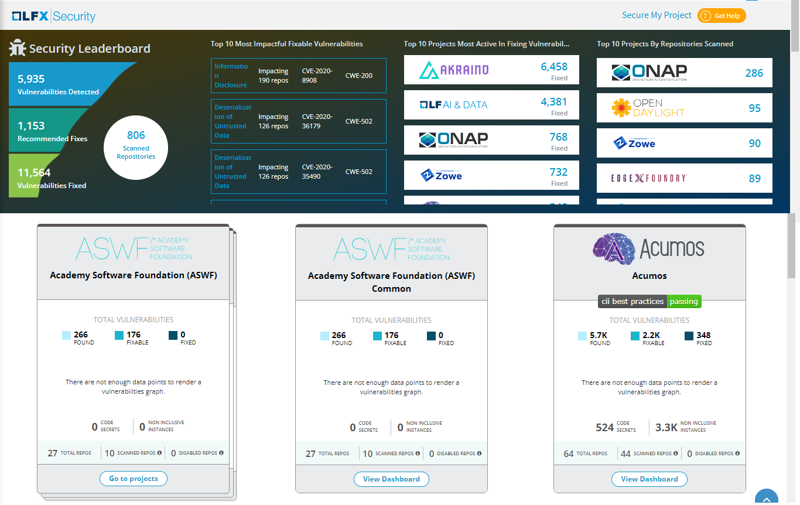
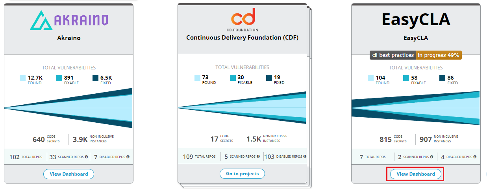

# Open LFX Security

LFX Security detects vulnerabilities in the LFX projects. Projects that are part of the LFX receive free daily scans through the LFX Security service in order to detect vulnerabilities in code repositories as well as library dependencies. LFX projects include a Vulnerability Report, which gives an overview of vulnerability severities.


Only project maintainers can access Vulnerability Detection details to gain visibility into open security issues and paths to remediation.


As a project maintainer, you can access vulnerability scan details for projects based on the LFX service you opted while enrolling your project

### Projects applied to LFX Security

To see vulnerability scan details for projects applied to LFX Security:

1.Login into [LFX Security](https://security.lfx.linuxfoundation.org).

2.On the Landing Page, you can see Security Leaderboard and Project Cards.

3.On a project card of interest, click **View Dashboard**.

4.The page navigates to the Authorization Page. You need to authorize as Member or Contributor/Maintainer to view issues. For more information, refer [Authorization Page](https://docs.linuxfoundation.org/lfx/security/security-v2/authorization-page).

### Access to view Vulnerability Report

If you are not authorized to see vulnerability report for a project or cannot view the dashboard, a toast message appears informing that you are not authorized to view issues.

### Foundation Project Groups

A Foundation project group is a group of individual projects. Normally Foundation group hosts group of projects in a single Foundation project.

A Foundation project with group of individual projects are displayed as shown in the following image:

 (1) (2).png>)

#### View Individual Projects in the Foundation Project

You can view the individual projects that are stacked in the Foundation project and check the issues related to the individual projects.

To view the individual projects, perform the following steps:

1.Click **Go to Projects** from the Foundation project.

2.The Security Summary is displayed along with the list of Individual project cards. The following Project Summary details are listed:

* Repositories Successfully Scanned
* Projects Successfully Scanned
* Projects Partially Scanned
* Issues Open
* Fixable Issues
* Issues Fixed
* Languages
* Upstream Dependencies
* Types of Licenses Found


The warning  icon provides information on why the security scan is failed for the repositories.


3\. You can also check the issues related to the individual project by click of **View Dashboard**.

## Security Leaderboard

Security Leaderboard is a type of dashboard that provides prominent statistics related to LFX Security. The Security Leaderboard provides the following information related to the LFX Security:

* Scanned repositories, vulnerability detected and fixed and also the recommended fixes
* Top 10 Most Impactful Fixable Vulnerabilities
* Top 10 Projects Most Active in Fixing Vulnerabilities
* Top 10 Projects by Repositories Scanned

### Scanned Repositories, Vulnerabilities and Fixes

The Security Leaderboard dashboard provides overview information on the repositories, vulnerabilities and fixes. The following statistical information is available for repositories, vulnerabilities and fixes:

* Number of scanned repositories
* Number of vulnerabilities detected in the repositories
* Number of recommended fixes provides for the detected vulnerability
* Number of fixed vulnerabilities

### Top 10 Most Impactful Fixable Vulnerabilities

Top 10 most impactful fixable vulnerabilities list shows you the top 10 fixable vulnerabilities along with the repositories impacted with the vulnerabilities, CVE and CWE. This list auto scrolls when you hover over the mouse on the list.

### Top 10 Projects Most Active in fixing vulnerabilities

Top 10 projects most active in fixing vulnerabilities list shows you the top 10 projects that have actively fixed the detected vulnerabilities. The list provides you the project name and the number of vulnerabilities fixed. This list auto scrolls when you hover over the mouse on the list.

### Top 10 Projects by Repositories Scanned

Top 10 projects by repositories scanned list shows you the top 10 projects with the highest number of repositories scanned in the project. The list provides you the project name and the number of repositories scanned for the project. This list auto scrolls when you hover over the mouse on the list.

