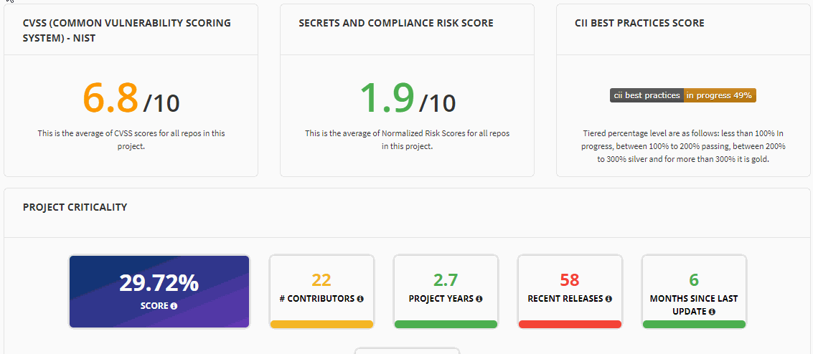
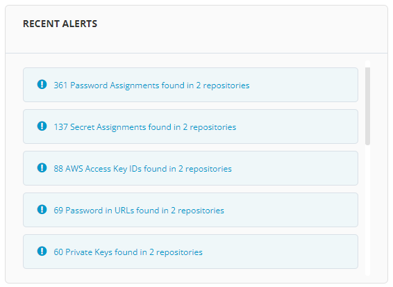
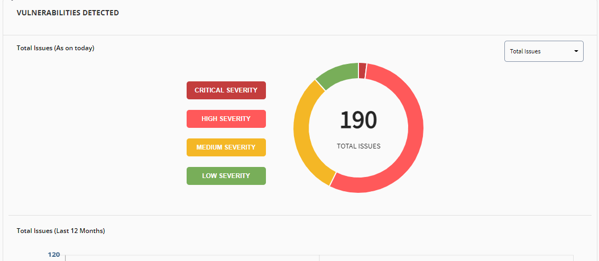
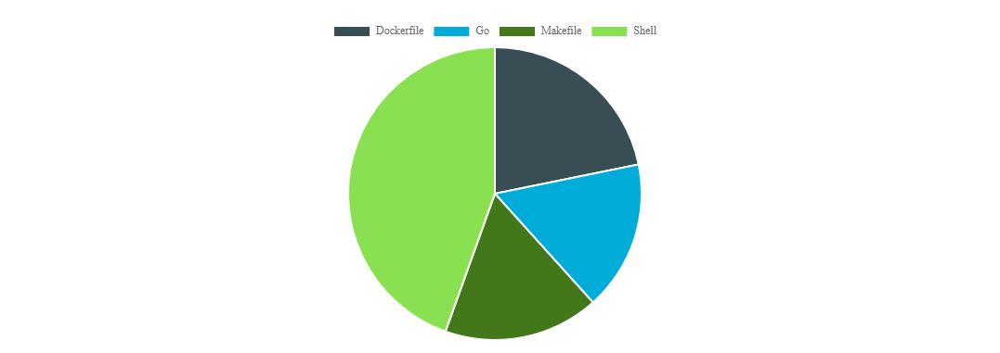

# Security Status Overview

The Overview dashboard gives you an overall view of security issues and history of all the repositories in your project to make them prominent.&#x20;

CVSS prioritizes vulnerability remediation activities and calculates the severity of vulnerabilities discovered in all your project repositories. The National Vulnerability Database (NVD) provides CVSS scores for almost all known vulnerabilities. Vulnerabilities are classified into HIGH/MEDIUM/LOW severity for easy prioritization.

The Security Overview page provides information on the following:

* Common Vulnerability Scoring System (CVSS) score
* Secrets and Compliance Risk Score&#x20;
* CII Best Practice Score&#x20;
* Project Criticality Score&#x20;
* A donut chart on Code Secrets detected&#x20;
* List of recent alerts&#x20;
* Non Inclusive Language&#x20;
* A donut and bar graph charts on vulnerabilities detected&#x20;
* Version Tree
* A pie chart on language details&#x20;

## Accessing Overview Security Page

To access Security Overview page, perform the following:

1.Login into LFX Security.&#x20;

2.The Landing page appears. Go to your required project and click **View Dashboard**.

.png>)

3.By default, you will see the **Overview** page.&#x20;

## CVV Score&#x20;

LFX Security uses the Common Vulnerability Scoring System (CVSS) as a standard measurement for the severity of vulnerabilities. This score is the average of CVSS scores for all repos in the project.

.png>)

## Secrets and Compliance Risk Score

LFX Security with collaboration from BluBracket provides this Secrets and Compliance Risk Score for each project. This score is the average of normalized Risk Scores for all repos in this project.

## Secrets and Compliance Risk Score&#x20;

Secrets and Compliance Risk Score This is the average of Normalized Risk Scores for all repos in this project.

## CII Best Practice Score

The Linux Foundation Core Infrastructure Initiative (CII) Best Practices badge is a way for Free or Libre and Open Source Software (FLOSS) projects to show that they follow best practices. Projects can voluntarily self-certify, at no cost, by using this web application to explain how they follow each best practice. For more information on CII Best Practices, refer [CII Best Practices](https://bestpractices.coreinfrastructure.org/en).&#x20;

The score provides you the percentage of best practice followed for your project and the status of the best practice. On click of the score, you can see the details related to the CII Best Practice.&#x20;

## Project Criticality

A project's criticality score defines the influence and importance of a project. This score provides you information on how critical is your project. Along with the critical score, it also provides other information such as:

* Number of contributors in the project
* Provides you the age of the project
* Information on the recent releases
* Number of months when the project was last updated
* Number of dependents of your project

.png>)

## &#x20;Code Secrets Detected

Code Secrets Detected donut chart provides you the number of code secrets detected in the project. It shows you various code secrets  detected in the project. On click of the detected code secret, the page  navigates to the Code Secret details page.&#x20;

.gif>)

## Recent Alerts

Recent Alerts provides you with list of code secrets alerts. This list provides you information on the type of code secrets detected across various repositories. It also list of the number of code secrets detected in the repository.&#x20;

## Non Inclusive Language&#x20;

The Non Inclusive Language cloud chart displays the list of non inclusive words that are used in the project.

## Vulnerabilities Detected

Dependency Issues Over Time **** shows a timeline of when security issues occurred and how many issues occurred at a certain time. Lines and icons in the timeline are colored to represent threat levels. Vulnerabilities Detected **** shows number of vulnerabilities according to their severity level.&#x20;


You can also filter the issues based on **Total Issues**, **Fixed Issues**, **Fixable Issues** and **Open Issues**.


Use this information to prioritize your investigation and remediation. To prioritize vulnerabilities, you might target one high-threat issue first. Additionally, it is important to focus on threats detected multiple times in the scanned code. Resolving one of these issues can make a marked difference in the security of the overall codebase.

## Version Tree and Language Details

Version tree is a graphical representation of the version details for a particular repository. As and when the changes are updated for the repository, a new version of the repository is created. The version tree provides details such as version number, updated date and time.&#x20;


By default version tree shows version information from beginning of GitHub Organization.


Language details is a graphical representation of the different code languages such as Go, Typescript, SCSS, HTML, PLpgSQL, shell and other languages available in the  repository. Language details provides a pie chart that shows the code breakup percentage of the language for the GitHub repository. This percentage helps you to identify the various language used and the percentage of that language used in the repository.

