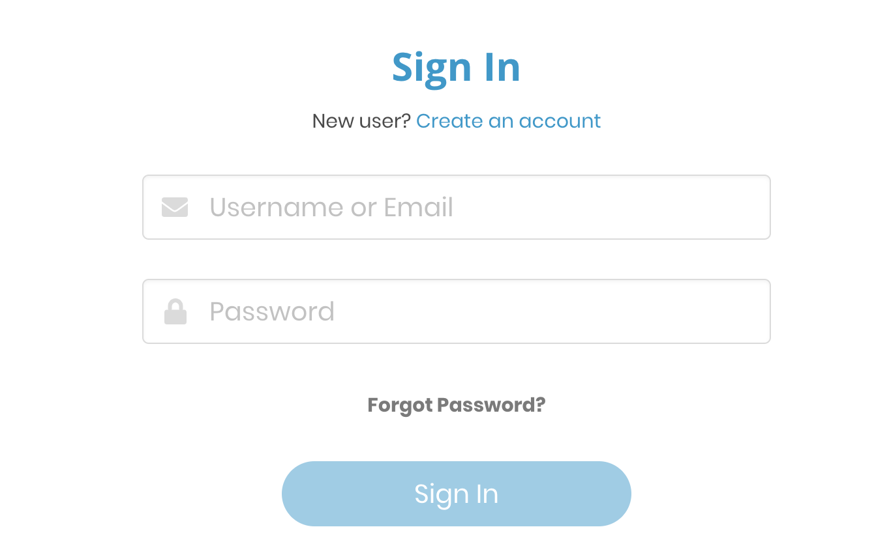

# Create an Account

## Create an account 

If you are logging in for the first time to any Linux Foundation managed service that is protected with Single Sign On,  you must create an account. To create a Linux Foundation SSO account, do the following:

1. For services like Events Registration, JIRA, Confluence, Training and Certification, etc, clicking on the service URL itself will present the Sign In page.
2.  For services like CommunityBridge funding or mentorship, you may be presented a "Login" or "Sign In" link when trying to apply or donate. Clicking on that link will also present the same Sign In page.
3. Click **Create Account**.

      ​

4. On the Create Account page, enter your email address, Username, First name, Last name, and Password.

   ​​

5. Click **Create Account**.  You should have received a verification email at the email address provided. If you did not receive an email, click **Resend Email**.

   ​​

6. Go to your inbox of the email address that you provided to create account, and open the email that you received from the Linux Foundation SSO service. Following is an example:

   

 6. Click **Verify Email**. On email verification, you are directed to "Sign In" page of the system you were trying to access.

             

