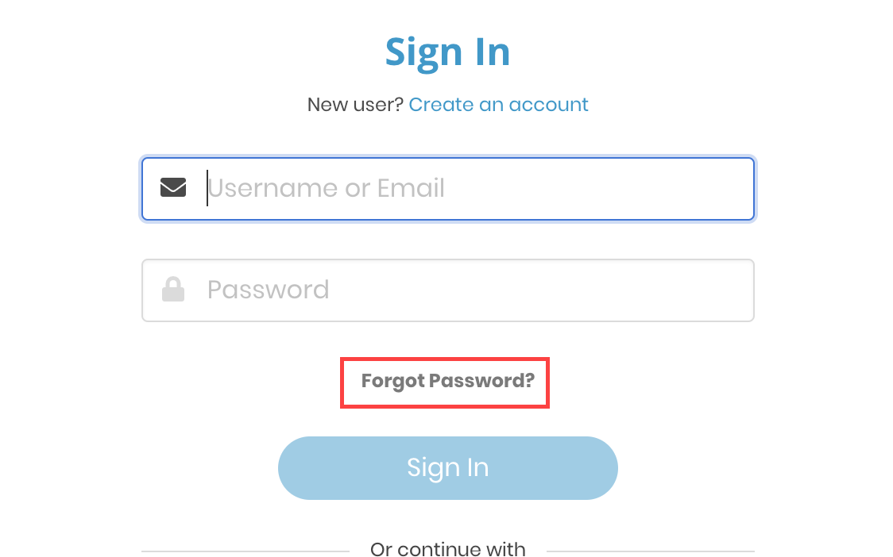

# Forgot Password

If you don't remember your LF account password, you can request to reset it.


A password change invalidates any of your active sessions for the secure services you are currently logged in to and you will need to sign in again.


1. On Sign In page, click on the **Forgot Password?** CTA link.

2. Enter your email address or username and click on the **Reset Password** CTA link.

3. You will receive an email verification at the email address you provided with the link to verify your email.  If you don't receive the email, click on **Did not Receive Link** CTA button.

4. Check your inbox for a `The Linux Foundation: Reset Password` email and click on the **Reset Password** CTA button. You will be navigated to a page where you can reset your password. 

                                         ​​

6. Enter a new password, confirm it and and click on the **Submit** CTA button to view a confirmation that your password was reset successfully.

