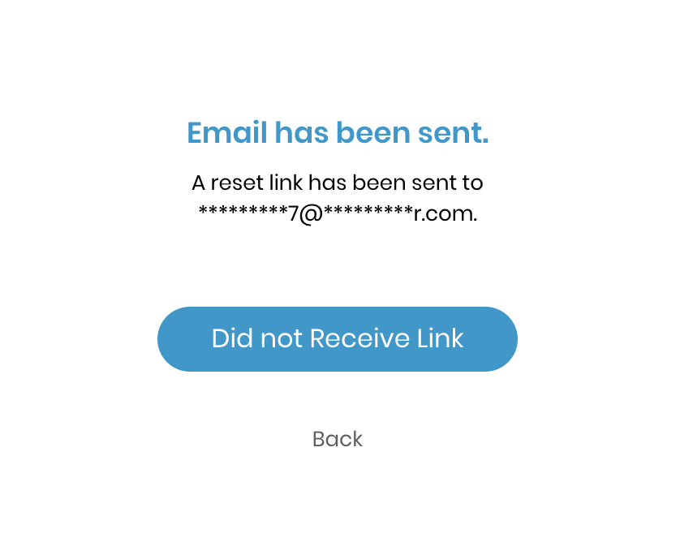
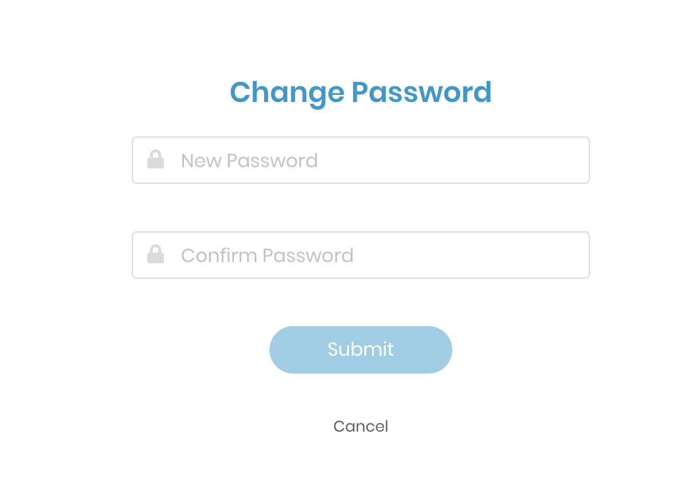

# Forgot Password

If you do not remember your Linux Foundation login password, you can make a request to reset your password.

**Note:** A password change invalidates any of your CommunityBridge sessions and you will need to log in again.

1. Go to [Linux Foundation website](https://lfx.platform.linuxfoundation.org/)

   The Login to LFX pane appears:

   ​

2. Click **Forgot Password?**.

   The **Forgot your Password?** window appears:

   ​​

3. Enter your email address or username and click **Reset Password**. A message informs you:

   ​​

              

                        

4. Check your email inbox for a `The Linux Foundation: Reset Password` email and open it.

5. Click **Reset Password**.

The Change Password window appears:

       ​​

1. Enter a new password and confirm it. Click **Submit**.

   The status bar confirms that your password is updated.

