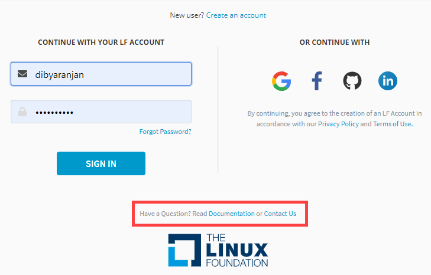
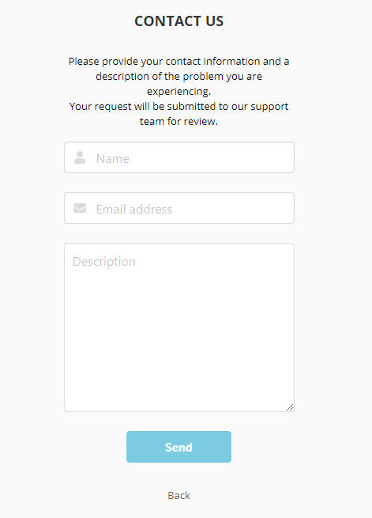

# Have a question

Get your questions answered simply by reading the documentation or get help out by creating a ticket with the Linux Foundation support team. 

1. At the bottom on the Sign In page you will see two options:

2. Click **Contact Us** to navigate to product support page to create a ticket with the Linux Foundation support team.

3. Complete the form and click **Send** . You will receive a confirmation email with a ticket number and your request description.

4. Click **Read Documentation** to read the user documentation.

