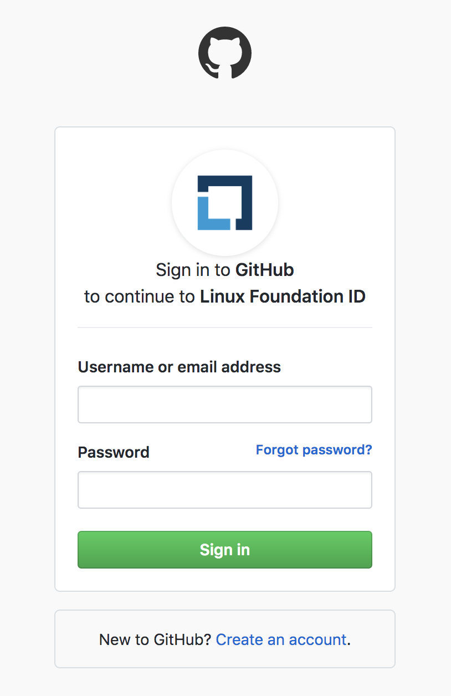

# Sign in With GitHub

A _social login_ is single sign-on for end users. You can use your existing login credentials from GitHub \(social network provider\) to log in to CommunityBridge rather than creating a CommunityBridge account. During your initial login, you enter your GitHub credentials to authenticate your GitHub account. Subsequent logins do not require you to enter your credentials⏤you simply click **Login with GitHub**. This one-click approach simplifies your logins.

## To Sign in with GitHub: 

1. Go to [Linux Foundation website](https://lfx.platform.linuxfoundation.org/) .
2. On the **Sign In** window, click **Login with GitHub**.  
 

   

   The Sign in to GitHub page appears.

   ​

3. Enter your GitHub user credentials and click **Sign in**.
4. Click **Authorize Linux Foundation** on Authorize Linux Foundation ID page.   **Note:** If you do not have a Linux Foundation account with the email address that you entered, the **Create an account** page appears.  
5. Enter a username, and click **Create Account**. **Note:** This username will be your Linux Foundation username, and will be synced with your email address.

The CommunityBridge Dashboard appears. Your user account appears on the top-left corner and above the Navigation pane:

