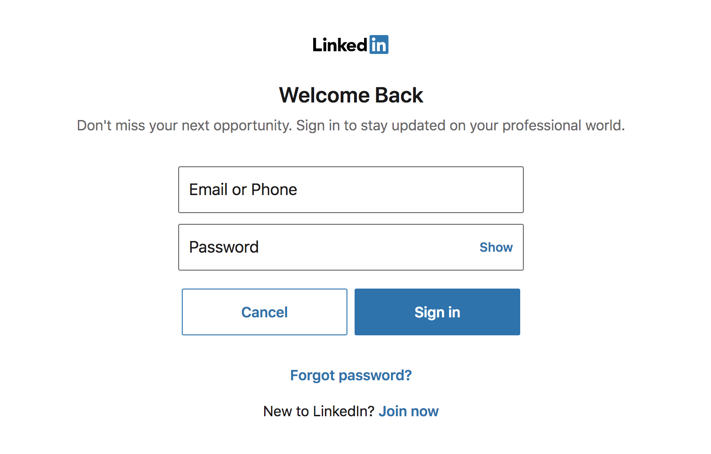
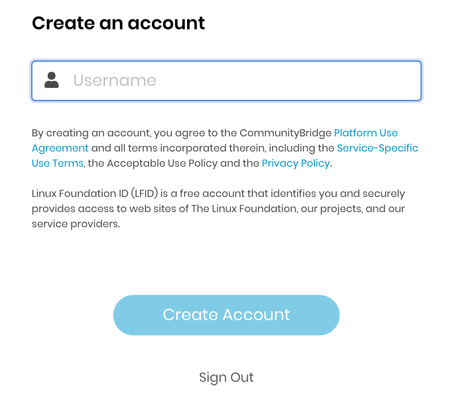

# Sign in with LinkedIn

You can use your login credentials from LinkedIn to Sign in to the protected Linux Foundation service instead of creating a SSO account. The first time you sign in, you would enter your LinkedIn credentials to authenticate your LinkedIn account. Subsequent logins would not require you to enter your credentials⏤you simply click the **LinkedIn** icon to sign in_**.**_ This one-click approach simplifies your logins.

## To Sign in with LinkedIn: 

1. On the **SSO page**, click the LinkedIn icon to continue to Sign in with LinkedIn.         
2. Enter your LinkedIn account credentials, and click **Sign in**.      
3. Thats it! You should be able to get access to the protected Linux Foundation service.This is usually the case if you already have a new or existing Linux Foundation SSO account. We simply map your SSO account to the social/3rd party login.
4. If you did not have an SSO account created earlier, then the **Create an account** page appears.                                                                          
5. Enter a username, and click **Create Account**.  **Note:** This username will be your new SSO Account Username, and will be synced with your email address.
6. You will be then directed to the protected service that you are trying to access.

